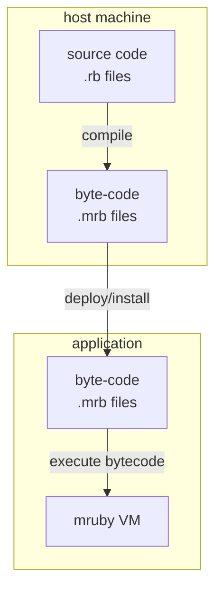

# mruby/cs

MRubyCS is a pure C# [mruby](https://github.com/mruby/mruby) virtual machine designed for seamless integration with C# game engines. It combines high Ruby-level compatibility with the performance and extensibility of modern C#.

Easily embed Ruby into Unity or .NET—empowering users to script game logic while keeping your core engine in C#.

> [!NOTE]
> [VitalRouter.MRuby](https://github.com/hadashiA/VitalRouter) provides a high-level framework for integrating MRubyCS with Unity (and .NET, including command routing and script lifecycle management.

## Why MRubyCS?

- **Zero native dependencies** — runs anywhere Unity/.NET runs. No per-platform native builds to maintain.
- **High performance** — leverages modern C# optimization, and .NET JIT.
- **Ruby compatible** — all opcodes implemented; passes mruby's official test suite.
  - Supported: [Array](https://github.com/hadashiA/MRubyCS/blob/main/tests/MRubyCS.Tests/ruby/test/array.rb), [Class](https://github.com/hadashiA/MRubyCS/blob/main/tests/MRubyCS.Tests/ruby/test/class.rb), [Fiber](https://github.com/hadashiA/MRubyCS/blob/main/tests/MRubyCS.Tests/ruby/test/fiber.rb), [Float](https://github.com/hadashiA/MRubyCS/blob/main/tests/MRubyCS.Tests/ruby/test/float.rb), [Hash](https://github.com/hadashiA/MRubyCS/blob/main/tests/MRubyCS.Tests/ruby/test/hash.rb), [Integer](https://github.com/hadashiA/MRubyCS/blob/main/tests/MRubyCS.Tests/ruby/test/integer.rb), [Module](https://github.com/hadashiA/MRubyCS/blob/main/tests/MRubyCS.Tests/ruby/test/module.rb), [Nil](https://github.com/hadashiA/MRubyCS/blob/main/tests/MRubyCS.Tests/ruby/test/nil.rb), [Proc](https://github.com/hadashiA/MRubyCS/blob/main/tests/MRubyCS.Tests/ruby/test/proc.rb), [Random](https://github.com/hadashiA/MRubyCS/blob/main/tests/MRubyCS.Tests/ruby/test/random.rb), [Range](https://github.com/hadashiA/MRubyCS/blob/main/tests/MRubyCS.Tests/ruby/test/range.rb), [Symbol](https://github.com/hadashiA/MRubyCS/blob/main/tests/MRubyCS.Tests/ruby/test/symbol.rb), [String](https://github.com/hadashiA/MRubyCS/blob/main/tests/MRubyCS.Tests/ruby/test/string.rb), [Time](https://github.com/hadashiA/MRubyCS/blob/main/tests/MRubyCS.Tests/ruby/test/time.rb)
- **Fiber & async/await** — suspend Ruby execution and await C# async methods without blocking threads.

## Limitations

- As of mruby 3.3, almost all bundled classes/methods are supported.
    - Support for extensions split into [mrbgems](https://github.com/mruby/mruby/tree/master/mrbgems) remains limited.
    - Some methods/specs added in 3.4 are not yet covered.
- However, basic private/protected visibility is already supported.

## Table of Contents

- [Installation](#installation)
    - [NuGet](#nuget)
    - [Unity](#unity)
- [Basic Usage](#basic-usage)
    - [MRubyState Lifecycle](#mrubystate-lifecycle)
    - [MRubyValue](#mrubyvalue)
        - [Symbol/String](#symbolstring)
        - [Embedded custom C# data into MRubyValue](#embedded-custom-c-data-into-mrubyvalue)
    - [Define ruby class/module/method by C#](#define-ruby-classmodulemethod-by-c)
    - [Call ruby method from C# side](#call-ruby-method-from-c-side)
- [Compiling Ruby source code](#compiling-ruby-source-code)
    - [MRubyCS.Compiler.Cli (dotnet tool)](#mrubycscompilercli-dotnet-tool)
    - [MRubyCS.Compiler (library)](#mrubycscompiler-library)
- [Fiber (Coroutine)](#fiber-coroutine)
- [MRubyCS.Serializer](#mrubycsserializer)

## Installation

### NuGet

| Package   | Description    | Latest version |
|:----------|:---------------|----------------|
| MRubyCS   |  Main package. A mruby vm implementation. | [](https://www.nuget.org/packages/MRubyCS) |
| MRubyCS.Compiler | Compile ruby source code utility. (Native binding)  | [](https://www.nuget.org/packages/MRubyCS.Compiler)   |
| MRubyCS.Compiler.Cli | dotnet tool for compiling Ruby source to bytecode | [](https://www.nuget.org/packages/MRubyCS.Compiler.Cli) |
| MRubyCS.Serializer  | Converting Ruby and C# Objects Between Each Other | [](https://www.nuget.org/packages/MRubyCS.Serializer)  |

### Unity

> [!NOTE]
> Requirements: Unity 2021.3 or later.

1. Install [NuGetForUnity](https://github.com/GlitchEnzo/NuGetForUnity).
2. Install following packages via NugetForUnity
    - Utf8StringInterpolation
    - MRubyCS
    - (Optional) MRubyCS.Serializer
3. (Optional) To install utilities for generating mrb bytecode, refer to the [Compiling Ruby source code](#compiling-ruby-source-code) section.

## Basic Usage

### MRubyState Lifecycle

`MRubyState` is the central object that holds the entire Ruby VM — symbol table, built-in classes, call stack, and all runtime state.

```cs
// Create a new VM instance.
var mrb = MRubyState.Create();

// Or, with additional configuration.
var mrb = MRubyState.Create(state =>
{
    state.DefineMethod(state.KernelModule, state.Intern("puts"u8), (s, self) =>
    {
        Console.WriteLine(s.GetArgumentAt(0));
        return MRubyValue.Nil;
    });
});
```

- **No `Dispose` needed** — `MRubyState` is fully managed by .NET GC. No native resources to release.
- **Not thread-safe** — each `MRubyState` instance must be used from a single thread. For multi-threaded scenarios, create a separate instance per thread.

> [!TIP]
> Option A is recommended for production. Option B is convenient for development and prototyping.

### Option A: Using CLI tool (pre-compile)

**1. Install**

```bash
dotnet add package MRubyCS
dotnet tool install -g MRubyCS.Compiler.Cli
```

**2. Write Ruby code** (`fibonacci.rb`)

```ruby
def fibonacci(n)
  return n if n <= 1
  fibonacci(n - 1) + fibonacci(n - 2)
end

fibonacci 10
```

**3. Compile to bytecode**

```bash
mruby-compiler fibonacci.rb -o fibonacci.mrb
```

**4. Execute in C#**

```cs
using MRubyCS;

var mrb = MRubyState.Create();
var bytecode = File.ReadAllBytes("fibonacci.mrb");
var result = mrb.LoadBytecode(bytecode);

result.IntegerValue //=> 55
```

> [!TIP]
> For local tool installation, use `dotnet tool install MRubyCS.Compiler.Cli` and run with `dotnet mruby-compiler`.

### Option B: Using Compiler library (runtime compile)

```bash
dotnet add package MRubyCS
dotnet add package MRubyCS.Compiler
```

```cs
using MRubyCS;
using MRubyCS.Compiler;

var mrb = MRubyState.Create();
var compiler = MRubyCompiler.Create(mrb);

var result = compiler.LoadSourceCode("""
    def fibonacci(n)
      return n if n <= 1
      fibonacci(n - 1) + fibonacci(n - 2)
    end

    fibonacci 10
    """u8);

result.IntegerValue //=> 55
```

> [!NOTE]
> `MRubyCS.Compiler` includes native binaries. See [Compiling Ruby source code](#compiling-ruby-source-code) for supported platforms.

### Irep

You can also parse bytecode in advance. The result is called `Irep` in mruby terminology. Pre-parsing is useful when you want to execute the same bytecode multiple times without re-parsing overhead.

```cs
Irep irep = mrb.ParseBytecode(bytecode);
mrb.Execute(irep);
```

`Irep` can be executed as is, or converted to `Proc`, `Fiber` before use. For details on Fiber, refer to the [Fiber](#fiber-coroutine) section.

### `MRubyValue`

Above `result` is `MRubyValue`. This represents a Ruby value.

```cs
value.IsNil //=> true if `nil`
value.IsInteger //=> true if integer
value.IsFloat //=> true if float
value.IsSymbol //=> true if Symbol
value.IsObject //=> true if any allocated object type

value.VType //=> get known ruby-type as C# enum.

value.IntegerValue //=> get as C# Int64
value.FloatValue //=> get as C# float
value.SymbolValue //=> get as `Symbol`

value.As<RString>() //=> get as internal String representation
value.As<RArray>() //=> get as internal Array representation
value.As<RHash>() //=> get as internal Hash representation

// pattern matching
if (value.Object is RString str)
{
    // ...
}

switch (value)
{
    case { IsInteger: true }:
        // ...
        break;
    case { Object: RString str }:
        // ...
        break;
}

var intValue = new MRubyValue(100); // create int value
var floatValue = new MRubyValue(1.234f); // create float value
var objValue = new MRubyValue(str); // create allocated ruby object value

// Or, we can cast implicitly and target-typed new
MRubyValue intValue = new(100);
```

#### Symbol/String

The string representation within mruby is utf8.
Therefore, to generate a ruby string from C#, [Utf8StringInterpolation](https://github.com/Cysharp/Utf8StringInterpolation) is used internally.


```cs
// Create string literal.
var str1 = mrb.NewString("HOGE HOGE"u8); // use u8 literal (C# 11 or newer)
var str2 = mrb.NewString($"FOO BAR"); // use string interpolation

var x = 123;
var str3 = mrb.NewString($"x={x}");

// wrap MRubyValue..
var strValue = new MRubyValue(str1);
```

There is a concept in mruby similar to String called `Symbol`.
Like String, it is created using utf8 strings, but internally it is a uint integer.
Symbols are usually used for method IDs and class IDs.

To create a symbol from C#, use `Intern`.

```cs
// symbol literal
var sym1 = mrb.Intern("sym");

// create symbol from string interporation
var x = 123;
var sym2 = mrb.Intern($"sym{x}");

// symbol to utf8 bytes
mrb.NameOf(sym1); //=> "sym"u8
mrb.NameOf(sym2); //=> "sym123"u8

// create symbol from string
var sym2 = mrb.AsSymbol(mrb.NewString($"hoge"));
```

> [!NOTE]
> Both `Intern(“str”)` and `Intern(“str”u8)` are valid, but the u8 literal is faster. We recommend using the u8 literal whenever possible.

#### Embedded custom C# data into MRubyValue

You can stuff any C# object into an MRubyValue.

This is useful when calling C# functionality from Ruby methods defined in C#.

```cs
class YourCustomClass
{
    public string Value { get; set; }
}

var csharpInstance = new YourCustomClass { Value = "abcde" };

var mrb = MRubyState.Create();

var data = new RData(csharpInstance);
state.SetConst(state.Intern("MYDATA"u8), state.ObjectClass, data);

// Use custom data from ruby
mrb.DefineMethod(mrb.ObjectClass, mrb.Intern("from_csharp_data"), (_, self) =>
{
    var dataValue = mrb.GetConst(state.Intern("MYDATA"u8), mrb.ObjectClass);
    var csharpInstance = dataValue.As<RData>().Data as YourCustomClass;
    // ...
});
```

#### Embedded custom C# data with ruby class

```cs
// Instances of classes that specify `MRubyVType.CSharpData` have `self` as RData.
var yourClass = DefineClass(Intern("MyCustomClass"u8), ObjectClass, MRubyVType.CSharpData);

// Define custom `initialize` with C# data
mrb.DefineMethod(yourClass, "initialize", (s, self) =>
{
    if (self.Object is RData x)
    {
        x.Data = new YourCustomClass { Value = "abcde" };
    }
    return self;
});

// Use custom C# data
mrb.DefineMethod(yourClass, "foo_method", (s, self) =>
{
    if (self.Object is RData { Data: YourCustomClass csharpInstance })
    {
        // Use C# data..
        csharpInstance.Value = "fghij";
    }
    // ...
});

```

### Define ruby class/module/method by C#

``` cs
// Define class
var classA = mrb.DefineClass(Intern("A"), c =>
{
    // Method definition that takes a required argument.
    c.DefineMethod(Intern("plus100"), (_, self) =>
    {
        var arg0 = mrb.GetArgumentAsIntegerAt(0); // get first argument (index:0)
        return arg0 + 100;
    });

    // Method definition that takes a block argument.
    c.DefineMethod(mrb.Intern("method2"), (_, self) =>
    {
        var arg0 = mrb.GetArgumentAt(0);
        var blockArg = mrb.GetBlockArgument();
        if (!blockArg.IsNil)
        {
            // Execute `Proc#call`
            mrb.Send(blockArg, mrb.Intern("call"), arg0);
        }
    });

    // Other complex arguments...
    c.DefineMethod(mrb.Intern("method3"), (_, self) =>
    {
        var keywordArg = mrb.GetKeywordArgument(mrb.Intern("foo"))
        Console.WriteLine($"foo: {keywordArg}");

        // argument type checking
        mrb.EnsureValueType(keywordArg, MRubyVType.Integer);

        var restArguments = mrb.GetRestArgumentsAfter(0);
        for (var i = 0; i < restArguments.Length; i++)
        {
            Console.WriteLine($"rest arg({i}: {restArguments[i]})");
        }
    });

    // class method
    c.DefineClassMethod(Intern("classmethod1"), (_, self) =>
    {
        return mrb.NewString($"hoge fuga");
    });
});

// Monkey patching
classA.DefineMethod(mrb.Intern("additional_method1"u8), (_, self) => { /* ... */ });

// Define module
var moduleA = mrb.DefineModule(mrb.Intern("ModuleA"));
mrb.DefineMethod(moduleA, mrb.Intern("additional_method2"), (_, self) => new MRubyValue(123));

mrb.IncludeModule(classA, moduleA);
```

As a result of the definition, the following Ruby code can now be executed.

```ruby
a = A.new
a.plus100(123) #=> 223

a.method2(1) { |a| a } #=> 1

a.additional_method2 #=> 123

A.classmethod1 #=> "hoge fuga"
```

### Call ruby method from C# side

```ruby
class A
  def self.foo = @@foo

  def self.foo=(x)
    @@foo = x
  end
end

class B
  attr_accessor :bar
end
@b = B.new

module M
  class C
    def self.foo = 999
  end
end
```

```cs
// get class instance
var classA = mrb.GetConst(mrb.Intern("A"), mrb.ObjectClass);

// call class method
mrb.Send(classA, mrb.Intern("foo="), new MRubyValue(123));
mrb.Send(classA, mrb.Intern("foo")); //=> 123

// get instance variable from top
var instanceB = mrb.GetInstanceVariable(mrb.TopSelf, mrb.Intern("@b"));
mrb.Send(instanceB, mrb.Intern("bar="), 456);
mrb.Send(instanceB, mrb.Intern("bar")); //=> 456

// find class instance on the hierarchy
var classC = mrb.Send(mrb.ObjectClass, mrb.Intern("const_get"), mrb.NewString($"M::C"));
```


## Compiling Ruby source code

mruby has the following architecture, and allows the compiler and runtime to be separated.

By distributing only precompiled bytecode, you can optimize the installation on the application.



By the way, MRubyCS only includes the mruby virtual machine. Therefore it is necessary to convert it to .mrb bytecode before executing the .rb source.

### MRubyCS.Compiler.Cli (dotnet tool)

The easiest way to compile Ruby source files is using the `mruby-compiler` dotnet tool.

```bash
# Install globally
$ dotnet tool install -g MRubyCS.Compiler.Cli
$ mruby-compiler input.rb -o output.mrb

# Or, install locally
$ dotnet tool install MRubyCS.Compiler.Cli
$ dotnet mruby-compiler input.rb -o output.mrb
```

```bash
# Dump bytecode in human-readable format
$ mruby-compiler input.rb --dump

# Generate C# code with embedded bytecode
$ mruby-compiler input.rb -o Bytecode.cs --format csharp --csharp-namespace MyApp
```

#### Options

| Option | Description |
|:-------|:------------|
| `-o`, `--output` | Output file path (default: same directory as input with `.mrb`/`.cs` extension). Use `-` for stdout. |
| `--dump` | Dump bytecode in human-readable format (outputs to stdout) |
| `--format` | Output format: `binary` (default) or `csharp` |
| `--csharp-namespace` | C# namespace for generated code (used with `--format csharp`) |
| `--csharp-class-name` | C# class name for generated code (used with `--format csharp`) |

### mrbc (original mruby compiler)

Alternatively, you can use the original [mruby](https://github.com/mruby/mruby) project's compiler.

```bash
$ git clone git@github.com:mruby/mruby.git
$ cd mruby
$ rake
$ ./build/host/bin/mrbc -o output.mrb input.rb
```

### MRubyCS.Compiler (library)

To simplify compilation from C#, we  provide the MRubyCS.Compiler package, which is a thin wrapper of the C# API for the native compiler.

> [!NOTE]
> Currently, builds for linux (x64/arm64), macOS (x64/arm64), and windows (x64) are provided.

```cs
dotnet add package MRubyCS.Compiler
```

#### Unity

Open the Package Manager window by selecting Window > Package Manager, then click on [+] > Add package from git URL and enter the following URL:

```
https://github.com/hadashiA/MRubyCS.git?path=src/MRubyCS.Unity/Assets/MRubyCS.Compiler.Unity#0.18.1
```

For manual compilation, refer to the following.

#### Usage

```cs
using MRubyCS.Compiler;

var source = """
def f(a)
  1 * a
end

f 100
"""u8;

var mrb = MRubyState.Create();
var compiler = MRubyCompiler.Create(mrb);

// Compile source code (returns CompilationResult)
using var compilation = compiler.Compile(source);

// Convert to irep (internal executable representation)
var irep = compilation.ToIrep();

// irep can be used later..
var result = mrb.Execute(irep); // => 100

// Or, get bytecode (mruby calls this format "Rite")
// bytecode can be saved to a file or any other storage
File.WriteAllBytes("compiled.mrb", compilation.AsBytecode());

// Can be used later from file
mrb.LoadBytecode(File.ReadAllBytes("compiled.mrb")); //=> 100

// or, you can evaluate source code directly
result = compiler.LoadSourceCode("f(100)"u8);
result = compiler.LoadSourceCode("f(100)");
```

#### Unity AssetImporter

In Unity, if you install this extension, importing a .rb text file will generate .mrb bytecode as a subasset.

For example, importing the text file `hoge.rb` into a project will result in the following.


This subasset is a TextAsset. To specify it in the inspector.

Or, to extract in C#, do the following:

``` cs
var mrb = MRubyState.Create();

var bytecodeAsset = (TextAsset)AssetDatabase.LoadAllAssetsAtPath("Assets/hoge.rb")
       .First(x => x.name.EndsWith(".mrb"));
mrb.LoadBytecode(bytecodeAsset.GetData<byte>().AsSpan());
```

To read a subasset in Addressables, you would do the following.

```cs
Addressables.LoadAssetAsync<TextAsset>("Assets/hoge.rb[hoge.mrb]")
```

Alternatively, you can generate the .mrb bytecode yourself within your project.

## Fiber (Coroutine)

MRubyCS supports Ruby Fibers, which are lightweight concurrency primitives that allow you to pause and resume code execution. In addition to standard Ruby Fiber features, MRubyCS provides seamless integration with C#'s async/await pattern.

### Basic Fiber Usage

```cs
using MRubyCS;
using MRubyCS.Compiler;

// Create state and compiler
var mrb = MRubyState.Create();
var compiler = MRubyCompiler.Create(mrb);

// Define a fiber that yields values
var code = """
    Fiber.new do |x|
      Fiber.yield(x * 2)
      Fiber.yield(x * 3)
      x * 4
    end
    """u8;

// Load the Ruby code as a Fiber
var irep = compiler.Compile(code);
var fiber = mrb.Execute(irep).As<RFiber>();

// Resume the fiber with initial value
var result1 = fiber.Resume(new MRubyValue(10));  // => 20

var result2 = fiber.Resume(new MRubyValue(10));  // => 30

var result3 = fiber.Resume(new MRubyValue(10));  // => 40 (final return value)

// Check if fiber is still alive
fiber.IsAlive  // => false
```

If you want to execute arbitrary code snippets as fibers, do the following.

```cs
var code = """
  x = 1
  y = 2
  Fiber.yield (x + y) * 100
  Fiber.yield (x + y) * 200
"""u8;

var fiber = compiler.LoadSourceCodeAsFiber(code);

// `LoadSourceCodeAsFiber` is same as:
// using var compilation = compiler.Compile(code);
// var proc = mrb.CreateProc(compilation.ToIrep());
// var fiber = mrb.CreateFiber(proc);

fiber.Resume(); //=> 300
fiber.Resume(); //=> 600
```

### Async/Await Integration

MRubyCS provides unique C# async integration features for working with Fibers:

```cs
// Wait for fiber to terminate
var code = """
    Fiber.new do |x|
      Fiber.yield
      Fiber.yield
      "done"
    end
    """u8;

var irep = compiler.Compile(code);
var fiber = mrb.Execute(irep).As<RFiber>();

// Start async wait before resuming
var terminateTask = fiber.WaitForTerminateAsync();

// Resume the fiber multiple times
fiber.Resume();
fiber.Resume();
fiber.Resume();

// Wait for completion
await terminateTask;
Console.WriteLine("Fiber has terminated");
```

You can consume fiber results as async enumerable:

```cs
var code = """
    Fiber.new do |x|
      3.times do |i|
        Fiber.yield(x * (i + 1))
      end
    end
    """u8;

var irep = compiler.Compile(code);
var fiber = mrb.Execute(irep).As<RFiber>();

// Process each yielded value asynchronously
await foreach (var value in fiber.AsAsyncEnumerable())
{
    Console.WriteLine($"Yielded: {value.IntegerValue}");
}
```

MRubyCS supports multiple consumers waiting for fiber results simultaneously:

```cs
var irep = compiler.Compile(code);
var fiber = mrb.Execute(irep).As<RFiber>();

// Create multiple consumers
var consumer1 = Task.Run(async () =>
{
    while (fiber.IsAlive)
    {
        var result = await fiber.WaitForResumeAsync();
        Console.WriteLine($"Consumer 1 received: {result}");
    }
});

var consumer2 = Task.Run(async () =>
{
    while (fiber.IsAlive)
    {
        var result = await fiber.WaitForResumeAsync();
        Console.WriteLine($"Consumer 2 received: {result}");
    }
});

// Resume fiber and both consumers will receive the results
fiber.Resume(new MRubyValue(10));
fiber.Resume(new MRubyValue(20));
fiber.Resume(new MRubyValue(30));

await Task.WhenAll(consumer1, consumer2);
```

> [!CAUTION]
> Waiting for fiber can be performed in a separate thread.
> However, MRubyState and mruby methods are not thread-safe.
> Please note that when using mruby functions, you must always return to the original thread.

### Error Handling in Fibers

Exceptions raised within fibers are properly propagated:

```cs
var code = """
    Fiber.new do |x|
      Fiber.yield(x)
      raise "Something went wrong"
    end
    """u8;

var irep = compiler.Compile(code);
var fiber = mrb.Execute(irep).As<RFiber>();

// First resume succeeds
var result1 = fiber.Resume(new MRubyValue(10));  // => 10

// Second resume will throw
try
{
    fiber.Resume();
}
catch (MRubyRaiseException ex)
{
    Console.WriteLine($"Ruby exception: {ex.Message}");
}

// Async wait will also propagate the exception
var waitTask = fiber.WaitForResumeAsync();
try
{
    fiber.Resume();
    await waitTask;
}
catch (MRubyRaiseException ex)
{
    Console.WriteLine($"Async exception: {ex.Message}");
}
```

### yield/resume from C#

It is possible to resume/yield from a method defined in C#.

```cs
mrb.DefineMethod(mrb.FiberClass, mrb.Intern("resume_by_csharp"u8), (state, self) =>
{
    return self.As<RFiber>().Resume();
});
```

```ruby
 fiber = Fiber.new do
   3.times do
     Fiber.yield
   end
 end

 fiber.resume_by_csharp
```

## MRubyCS.Serializer

Using the MRuby.Serializer package enables conversion between MRubyValue and C# objects.

```cs
// Deserialize (MRubyValue -> C#)

MRubyValue result1 = mrb.LoadSourceCode("111 + 222");
MRubyValueSerializer.Deserialize<int>(result1, mrb); //=> 333

MRubyValue result2 = mrb.LoadSourceCode("'hoge'.upcase");
MRubyValueSerializer.Deserialize<string>(result2, mrb); //=> "HOGE"
```

```cs
// Serialize (C# -> MRubyValue)

var intArray = new int[] { 111, 222, 333 };

MRubyValue value = MRubyValueSerializer.Serialize(intArray, mrb);

var mrubyArray = value.As<RArray>();
mrubyArray[0] //=> 111
mrubyArray[1] //=> 222
mrubyArray[2] //=> 333
```

```cs
MRubyValue mrubyStringValue = MRubyValueSerializer.Serialize("hoge fuga", mrb);

// Use the serialized value...
mrb.Send(mrubyStringValue, mrb.Intern("upcase")); //=> MRubyValue("UPCASE")
```

### Builtin Supported types

The following C# types and MRubyValue type conversions are supported natively:

| mruby     | C#                                                                                                                                                                                                                                                                                                                                                                                      |
|-----------|:----------------------------------------------------------------------------------------------------------------------------------------------------------------------------------------------------------------------------------------------------------------------------------------------------------------------------------------------------------------------------------------|
| `Integer` | `int`, `uint`, `long`, `ulong`, `short`, `ushort`, `byte`, `sbyte`, `char`                                                                                                                                                                                                                                                                                                                |
| `Float`   | `float`, `double`, `decimal`                                                                                                                                                                                                                                                                                                                                                            |
| `Array`   | `T`, `List<>`, `T[,]`, `T[,]`, `T[,,]`, <br />`Tuple<...>`, `ValueTuple<...>`, <br />, `Stack<>`, `Queue<>`, `LinkedList<>`, `HashSet<>`, `SortedSet<>`, <br />`Collection<>`, `BlockingCollection<>`, <br />`ConcurrentQueue<>`, `ConcurrentStack<>`, `ConcurrentBag<>`, <br />`IEnumerable<>`, `ICollection<>`, `IReadOnlyCollection<>`, <br />`IList<>`, `IReadOnlyList<>`, `ISet<>` |
| `Hash`    | `Dictionary<,>`, `SortedDictionary<,>`, `ConcurrentDictionary<,>`, <br />`IDictionary<,>`, `IReadOnlyDictionary<,>`                                                                                                                                                                                                                                                                     |
| `String`  | `string`, `byte[]`                                                                                                                                                                                                                                                                                                                                                                      |
| `Symbol`  | `Enum`
| `nil`     | `T?`, `Nullable<T>`                                                                                                                                                                                                                                                                                                                                                                     |

#### Unity-specific types

By introducing the following packages, serialization of Unity-specific types will also be supported.

Open the Package Manager window by selecting Window > Package Manager, then click on [+] > Add package from git URL and enter the following URL:

```
https://github.com/hadashiA/MRubyCS.git?path=src/MRubyCS.Unity/Assets/MRubyCS.Serializer.Unity#0.18.1
```

| mruby                                | C#  |
|--------------------------------------|:--------------------------------------------------------------------------------------------------------------------|
| `[Float, Float]`                     | `Vector2`, `Resolution`                                                          |
| `[Integer, Integer]`                 | `Vector2Int`                      |
| `[Float, Float, Float]`              | `Vector3`|
| `[Int, Int, Int]`                    | `Vector3Int` |
| `[Float, Float, Float, Float]`       | `Vector4`, `Quaternion`, `Rect`, `Bounds`, `Color`|
| `[Int, Int, Int, Int]`               | `RectInt`, `BoundsInt`, `Color32` |


### Naming Convention

- C# property/field names are converted to underscore style in Ruby
    - e.g) `FooBar` <-> `foo_bar`
- C# enum values are converted to underscore-style symbols in Ruby
    - e.g) `EnumType.FooBar` <-> `:foo_bar`

### `[MRubyObject]` attribute

Marking with `[MRubyObject]` enables bidirectional conversion between custom C# types and MRubyValue.

- Converts C# type properties/fields into Ruby world `Hash` key/value pairs.
- class, struct, and record are all supported.
- A partial declaration is required.
- Members that meet the following conditions are converted from mruby:
    - public fields or properties, or fields or properties with the `[MRubyMember]` attribute.
    - And have a setter (private is acceptable).

```cs
[MRubyObject]
partial struct SerializeExample
{
    // this is serializable members
    public string Id { get; private set; }
    public int X { get; init; }
    public int FooBar;

    [MRubyMember]
    public int Z;

    // ignore members
    [MRubyIgnore]
    public float Foo;
}
```

```cs
// Deserialize (MRubyValue -> C#)

var value = mrb.LoadSourceCode("{ id: 'aiueo', x: 1234, foo_bar: 4567, z: 8901 }");

SerializeExample deserialized = MRubyValueSerializer.Deserialize<SerializeExample>(value, mrb);
deserialized.Id     //=> "aiueo"
deserialized.X      //=> 1234
deserialized.FooBar //=> 4567
deserialized.Z      //=> 8901
```

```cs
// Serialize (C# -> MRubyValue)
var value = MRubyValueSerializer.Serialize(new SerializeExample { Id = "aiueo", X = 1234, FooBar = 4567 });

var props = value.As<RHash>();
props[mrb.Intern("id")] //=> "aiueo"
props[mrb.Intern("x")] //=> 1234
props[mrb.Intern("foo_bar")] //=> 4567
```

The list of properties specified by mruby is assigned to the C# member names that match the key names.

Note:
- The names on the ruby side are converted to CamelCase.
   - Example: ruby's `foo_bar` maps to C#'s `FooBar`.
- The values of C# enums are serialized as Ruby symbols.
    - Example: `Season.Summer` becomes Ruby's `:summer`.

You can change the member name specified from Ruby by using `[MRubyMember("alias name")]`.

```cs
[MRubyObject]
partial class Foo
{
    [MRubyMember("alias_y")]
    public int Y;
}
```

Also, you can receive data from Ruby via any constructor by using the `[MRubyConstructor]` attribute.

```cs
[MRubyObject]
partial class Foo
{
    public int X { get; }

    [MRubyConstructor]
    public Foo(int x)
    {
        X = x;
    }
}
```

### Dynamic serialization

Specifying a `dynamic` type parameter allows conversion to C# Array/Dictionary and primitive types.

```cs
var array = mrb.NewArray();
array.Push(123);

var result = MRubyValueSerializer.Deserialize<dynamic>(array, mrb);

((object[])result).Length //=> 1
((object[])result)[0] //=> 123
```

### Custom Formatter

You can also customize the conversion of any C# type to an MRubyValue.

```cs
 // custom type example
struct Vector3
{
    public int X;
    public int Y;
    public int Z;
}
```

```cs
// Implement `IMRubyValueFormatter`
class CustomVector3Formatter : IMRubyValueFormatter<Vector3>
{
    public static readonly CustomVector3Formatter Instance = new();

    public MRubyValue Serialize(Vector3 value, MRubyState mrb, MRubyValueSerializerOptions options)
    {
        var array = mrb.NewArray();
        array.Push(value.X);
        array.Push(value.Y);
        array.Push(value.Z);
        return array;
    }
    public Vector3 Deserialize(MRubyValue value, MRubyState mrb, MRubyValueSerializerOptions options)
    {
        // validation
        MRubySerializationException.ThrowIfTypeMismatch(value, MRubyVType.Array);
        MRubySerializationException.ThrowIfNotEnoughArrayLength(value, 3);

        var array = value.As<RArray>();
        return new Vector3
        {
            X = array[0].IntegerValue,
            Y = array[1].IntegerValue,
            Z = array[2].IntegerValue,
        }
    }
}
```

To set a custom formatter, specify options as an argument to MRubyValueSerializer.

Specify the enumeration of Formatter and Formatter's Resolver instances.
`StandardResolver` supports the default behavior, so specify this along with additional formatters.

```cs
// Create a new formatter resolver.
var resolver = CompositeResolver.Create(
    [CustomVector3Formatter.Instance],
    [StandardResolver.Instance]
    );

var options = new MRubyValueSerializerOptions
{
    Resolver = resolver,
};

var value = mrb.LoadSourceCode("[111, 222, 333]");
Vector3 deserialized = MRubyValueSerializer.Deserialize<Vector3>(value, mrb, options);
deserialized.X //=> 111
deserialized.Y //=> 222
deserialized.Z //=> 333
```

## LICENSE

MIT

## Contact

[@hadashiA](https://x.com/hadashiA)

