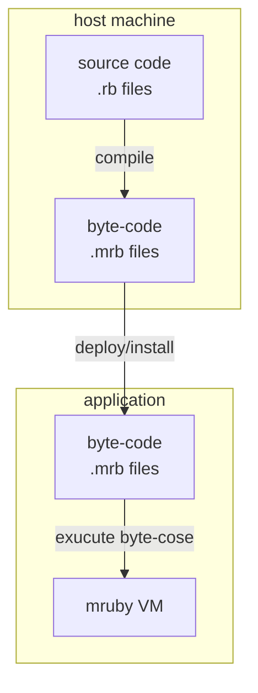
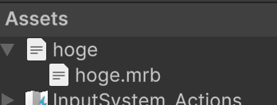

# MRubyCS

> [!NOTE]
> This project was initially called MRubyD, but was renamed to MRubyCS.


MRubyCS is a new [mruby](https://github.com/mruby/mruby) virtual machine implemented in pure C#. The name "mruby/cs" stands for *mruby implemented in C#*. Designed with seamless integration in mind for C#-based game engines, and emphasize ruby level compatibility. MRubyCS leverages the latest C# features for high performance and high extensibility.

## Features

- **Implemented in C#**
  Utilizes the robust capabilities of C# to ensure seamless integration with C#-based game engines.

- **High Performance**
  Takes advantage of modern C# language features such as managed pointers, `Span`, and the performance benefits of the .NET runtimes GC and JIT compiler to deliver superior speed and efficiency.

- **High compatibility with Ruby-level APIs**
  It is intended for use in software with a certain amount of resources, such as games/gui-apps. For this reason, we are focusing on Ruby API compatibility.
  At this time, all opcodes are implemented and pass the [syntax.rb](https://github.com/hadashiA/MRubyCS/blob/main/tests/MRubyCS.Tests/ruby/test/syntax.rb), [class.rb](https://github.com/hadashiA/MRubyCS/blob/main/tests/MRubyCS.Tests/ruby/test/class.rb), [module.rb](https://github.com/hadashiA/MRubyCS/blob/main/tests/MRubyCS.Tests/ruby/test/module.rb) and built-in libs tests from the original mruby repository.

- **Portability & Extensibility**
  Compared to the original C implementation, calling C# extensive libraries from Ruby is straightforward, making the VM highly extensible.

- **Fiber and async/await integration**
  You can communicate between the Ruby world and the C# world like channels without blocking threads with `Fiber`. This enables integration such as suspending Ruby and then executing async methods in the C# world.

## Limitations

- `private` and `protected` visibitily is not yet implemented. (mruby got support for this in 3.4)
- This project provides only the VM implementation; it does not include a compiler. To compile mruby scripts, see [Compiling Ruby source code](#compiling-ruby-source-code) section.

### Most recent roadmap

- [ ] [VitalRouter.MRuby](https://github.com/hadashiA/VitalRouter) for the new version.

## Table of Contents

- [Installation](#installation)
    - [NuGet](#nuget)
    - [Unity](#unity)
- Usages
    - [Basic Usage](#basic-usage)
    - [Symbol/String](#symbol-string)
    - [Fiber (Coroutine)](#fiber-coroutine)
- [Compiling Ruby source code](#compiling-ruby-source-code)
    - [MRubyCS.Compiler](#mrubycs-compiler)

## Installation

### NuGet

``` bash
dotnet add package MRubyCS
```

### Unity

> [!NOTE]
> Requirements: Unity 2021.3 or later.

1. Install [NugetForUnity](https://github.com/GlitchEnzo/NuGetForUnity).
2. Open the NuGet window by going to NuGet > Manage NuGet Packages, “Show Preleaseâ€toggled on, after search for the "MRubyCS" package, and install it.
3. (Optional) To install utilities for generating mrb bytecode, refer to the [Compiling Ruby source code](#compiling-ruby-source-code) section.

## Basic Usage

```ruby
def fibonacci(n)
  return n if n <= 1
  fibonacci(n - 1) + fibonacci(n - 2)
end

fibonacci 10
```

``` bash
$ mrbc -o fibonaci.mrbc fibonacci.rb
```

``` cs
using MRubyCS;

// initialize state
var state = MRubyState.Create();

// Read the .mrb byte-code.
var bytecode = File.ReadAllBytes("fibonacci.mrb");

// execute bytecoe
var result = state.LoadBytecode(bytecode);

result.IsInteger    //=> true
result.IntegerValue //=> 55
```

You can also parse bytecode in advance.
The result of parsing bytecode is called `Irep` in mruby terminology.

``` cs
Irep irep = state.ParseBytecode(bytecode);

state.Execute(irep);
```

`Irep` can be executed as is, or converted to `Proc`, `Fiber` before use. For details on Fiber, refer to the [Fiber](#fiber-coroutine) section.

This is a sample of executing bytecode.
See the [Compiling Ruby source code](#compiling-ruby-source-code) section for information on how to convert Ruby source code to mruby bytecode.

### Handling `MRubyValue`

Above `result` is `MRubyValue`. This represents a Ruby value.

``` cs
value.IsNil //=> true if `nil`
value.IsInteger //=> true if integrr
value.IsFloat //=> true if float
value.IsSymbol //=> true if Symbol
value.IsObject //=> true if any allocated object type

value.VType //=> get known ruby-type as C# enum.

value.IntegerValue //=> get as C# Int64
value.FloatValue //=> get as C# float
value.SymbolValue //=> get as `Symbol`

value.As<RString>() //=> get as internal String representation
value.As<RArray>() //=> get as internal Array representation
value.As<RHash>() //=> get as internal Hash representation

// pattern matching
if (vlaue.Object is RString str)
{
    // ...
}

swtich (value)
{
    case { IsInteger: true }:
        // ...
        break;
    case { Object: RString str }:
        // ...
        break;
}

var intValue = new MRubyValue(100); // create int value
var floatValue = new MRubyValue(1.234f); // create float value
var objValue = new MRubyValue(str); // create allocated ruby object value

// Or, we can cast implicitly and target-typed new
MRubyValue intValue = new(100);
```

### Define ruby class/module/method by C#

``` cs
// Create MRubyState object.
var state = MRubyState.Create();

// Define class
var classA = state.DefineClass(Intern("A"u8), c =>
{
    // Method definition that takes a required argument.
    c.DefineMethod(Intern("plus100"u8), (state, self) =>
    {
        var arg0 = state.GetArgumentAsIntegerAt(0); // get first argument (index:0)
        return arg0 + 100;
    });

    // Method definition that takes a block argument.
    c.DefineMethod(Intern("method2"), (state, self) =>
    {
        var arg0 = state.GetArgumentAt(0);
        var blockArg = state.GetBlockArgument();
        if (!blockArg.IsNil)
        {
            // Execute `Proc#call`
            state.Send(blockArg, state.Intern("call"u8), arg0);
        }
    });

    // Other complex arguments...
    c.DefineMethod(Intern("method3"), (state, self) =>
    {
        var keywordArg = state.GetKeywordArgument(state.Intern("foo"))
        Console.WriteLine($"foo: {keywordArg}");

        // argument type checking
        state.EnsureValueType(keywordArg, MrubyVType.Integer);

        var restArguments = state.GetRestArgumentsAfter(0);
        for (var i = 0; i < restArguments.Length; i++)
        {
            Console.WriteLine($"rest arg({i}: {restArguments[i]})");
        }
    });

    // class method
    c.DefineClassMethod(Intern("classmethod1"), (state, self) =>
    {
        return state.NewString($"hoge fuga");
    });

});

// Monkey patching
classA.DefineMethod(Intern("additional_method1"u8), (state, self) => { /* ... */ });

// Define module
var moduleA = state.DefineModule(Intern("ModuleA");)
state.DefineMethod(moduleA, Intern("additional_method2"u8), (state, self) => new MRubyValue(123));

state.IncludeModule(classA, moduleA);
```

As a result of the definition, the following Ruby code can now be executed.

```ruby
a = A.new
a.plus100(123) #=> 223

a.method2(1) { |a| a } #=> 1

a.additionoa_method2 #=> 123

A.classmethod1 #=> "hoge fuga"
```

### Call ruby method from C# side

```ruby
class A
  def self.foo = @@foo

  def self.foo=(x)
    @@foo = x
  end
end

class B
  attr_accessor :bar
end
@b = B.new

module M
  class C
    def self.foo = 999
  end
end
```

```cs
// get class instance
var classA = mrb.GetConst(mrb.Intern("A"u8), mrb.ObjectClass);

// call class method
mrb.Send(classA, mrb.Intern("foo="u8), new MRubyValue(123));
mrb.Send(classA, mrb.Intern("foo"u8)); //=> 123

// get instance variable from top
var instanceB = mrb.GetInstanceVariable(mrb.TopSelf, mrb.Intern("@b"u8));
mrb.Send(instanceB, mrb.Intern("bar="u8), new MRubyValue(456));
mrb.Send(instanceB, mrb.Intern("bar"u8)); //=> 456

// find class instance on the hierarchy
var classC = mrb.Send(mrb.ObjectClass, mrb.Intern("const_get"u8), mrb.NewString("M::C"u8));
```


## Symbol/String

The string representation within mruby is utf8.
Therefore, to generate a ruby string from C#, [Utf8StringInterpolation](https://github.com/Cysharp/Utf8StringInterpolation) is used internally.


```cs
// Create string literal.
var str1 = state.NewString("HOGE HOGE"u8);

// Create string via interpolation
var x = 123;
var str2 = state.NewString($"x={x}");

// wrap MRubyValue..
var strValue = new MRubyValue(str1);
```

There is a concept in mruby similar to String called `Symbol`.
Like String, it is created using utf8 strings, but internally it is a uint integer.
Symbols are usually used for method IDs and class IDs.

To create a symbol from C#, use `Intern`.

```cs
// symbol literal
var sym1 = state.Intern("sym"u8);

// create symbol from string interporation
var x = 123;
var sym2 = state.Intern($"sym{x}");

// symbol to utf8 bytes
state.NameOf(sym1); //=> "sym"u8
state.NameOf(sym2); //=> "sym123"u8

// create symbol from string
var sym2 = state.ToSymbol(state.NewString("hoge"u8));
```

## Fiber (Coroutine)

MRubyCS supports Ruby Fibers, which are lightweight concurrency primitives that allow you to pause and resume code execution. In addition to standard Ruby Fiber features, MRubyCS provides seamless integration with C#'s async/await pattern.

### Basic Fiber Usage

```cs
using MRubyCS;
using MRubyCS.Compiler;

// Create state and compiler
var state = MRubyState.Create();
var compiler = MRubyCompiler.Create(state);

// Define a fiber that yields values
var code = """
    Fiber.new do |x|
      Fiber.yield(x * 2)
      Fiber.yield(x * 3)
      x * 4
    end
    """u8;

// Load the Ruby code as a Fiber
var fiber = compiler.LoadSourceCode(code).As<RFiber>();

// Resume the fiber with initial value
var result1 = fiber.Resume(new MRubyValue(10));  // => 20

var result2 = fiber.Resume(new MRubyValue(10));  // => 30

var result3 = fiber.Resume(new MRubyValue(10));  // => 40 (final return value)

// Check if fiber is still alive
fiber.IsAlive  // => false
```

If you want to execute arbitrary code snippets as fibers, do the following.

```
var fiber = compiler.LoadSourceCodeAsFiber("""
  x = 1
  y = 2
  Fiber.yield (x + y) * 100
  Fiber.yield (x + y) * 200
"""u8);

fiber.Resume(); //=> 300
fiber.Resume(); //=> 600
```


### Async/Await Integration

MRubyCS provides unique C# async integration features for working with Fibers:

```cs
// Wait for fiber to terminate
var code = """
    Fiber.new do |x|
      Fiber.yield
      Fiber.yield
      "done"
    end
    """u8;

var fiber = compiler.LoadSourceCode(code).As<RFiber>();

// Start async wait before resuming
var terminateTask = fiber.WaitForTerminateAsync();

// Resume the fiber multiple times
fiber.Resume();
fiber.Resume();
fiber.Resume();

// Wait for completion
await terminateTask;
Console.WriteLine("Fiber has terminated");
```

You can consume fiber results as async enumerable:

```cs
var code = """
    Fiber.new do |x|
      3.times do |i|
        Fiber.yield(x * (i + 1))
      end
    end
    """u8;

var fiber = compiler.LoadSourceCode(code).As<RFiber>();

// Process each yielded value asynchronously
await foreach (var value in fiber.AsAsyncEnumerable())
{
    Console.WriteLine($"Yielded: {value.IntegerValue}");
}
```

MRubyCS supports multiple consumers waiting for fiber results simultaneously:

```cs
var fiber = compiler.LoadSourceCode(code).As<RFiber>();

// Create multiple consumers
var consumer1 = Task.Run(async () =>
{
    while (fiber.IsAlive)
    {
        var result = await fiber.WaitForResumeAsync();
        Console.WriteLine($"Consumer 1 received: {result}");
    }
});

var consumer2 = Task.Run(async () =>
{
    while (fiber.IsAlive)
    {
        var result = await fiber.WaitForResumeAsync();
        Console.WriteLine($"Consumer 2 received: {result}");
    }
});

// Resume fiber and both consumers will receive the results
fiber.Resume(new MRubyValue(10));
fiber.Resume(new MRubyValue(20));
fiber.Resume(new MRubyValue(30));

await Task.WhenAll(consumer1, consumer2);
```

> [!CAUTION]
> Waiting for fiber can be performed in a separate thread.
> However, MRubyState and mruby methods are not thread-safe.
> Please note that when using mruby functions, you must always return to the original thread.

### Error Handling in Fibers

Exceptions raised within fibers are properly propagated:

```cs
var code = """
    Fiber.new do |x|
      Fiber.yield(x)
      raise "Something went wrong"
    end
    """u8;

var fiber = compiler.LoadSourceCode(code).As<RFiber>();

// First resume succeeds
var result1 = fiber.Resume(new MRubyValue(10));  // => 10

// Second resume will throw
try
{
    fiber.Resume();
}
catch (MRubyRaiseException ex)
{
    Console.WriteLine($"Ruby exception: {ex.Message}");
}

// Async wait will also propagate the exception
var waitTask = fiber.WaitForResumeAsync();
try
{
    fiber.Resume();
    await waitTask;
}
catch (MRubyRaiseException ex)
{
    Console.WriteLine($"Async exception: {ex.Message}");
}
```

## Compiling Ruby source code

mruby has the following architecture, and allows the compiler and runtime to be separated.

By distributing only precompiled bytecode, you can optimize the installation on the application.



By the way, MRubyCS only includes the mruby virtual machine. Therefore it is necessary to convert it to .mrb bytecode before executing the .rb source.
Basically, you need the native compiler provided by the [mruby](https://github.com/mruby/mruby) project.

```bash
$ git clone git@github.com:mruby/mruby.git
$ cd mruby
$ rake
$ ./build/host/bin/mrubc
```

### MRubyCS.Compiler

To simplify compilation from C#, we also provide the MRubyCS.Compiler package, which is a thin wrapper for the native compiler.

> [!NOTE]
> This MRubyCS.Compiler package is a thin wrapper for the native binary. Currently, builds for linux (x64/arm64), macOS (x64/arm64), and windows (x64) are provided.

```cs
dotnet add package MRubyCS.Compiler
```

#### Unity

Open the Package Manager window by selecting Window > Package Manager, then click on [+] > Add package from git URL and enter the following URL:

```
https://github.com/hadashiA/MRubyCS.git?path=src/MRubyCS.Compiler.Unity/Assets/MRubyCS.Compiler#0.12.0
```

If you install this extension, importing a .rb text file will generate .mrb bytecode as a subasset.

For example, importing the text file `hoge.rb` into a project will result in the following.



This subasset is a TextAsset. To specify it in the inspector.

Or, to extract in C#, do the following:
``` cs
var state = MRubyState.Create();

var bytecodeAsset = (TextAsset)AssetDatabase.LoadAllAssetsAtPath("Assets/hoge.rb")
       .First(x => x.name.EndsWith(".mrb"));
state.LoadBytecode(bytecodeAsset.GetData<byte>().AsSpan());
```

For manual compilation, refer to the following.

#### Usage

```cs
using MRubyCS.Compiler;

var source = """
def f(a)
  1 * a
end

f 100
"""u8;

var state = MRubyState.Create();
var compiler = MRubyCompiler.Create(state);

// Compile to irep (internal executable representation)
var irep = compiler.Compile(source);
var result = state.Execute(irep); // => 100

// Compile to bytecode (mruby called this format is "Rite")
using var bin = compiler.CompileToBytecode(source);
File.WriteAllBytes("compiled.mrb", bin.AsSpan());

state.LoadBytecode(File.ReadAllBytes("compiled.mrb")); //=> 100

// Compile and evaluate:
result = compiler.LoadSourceCode("f(100)"u8);
result = compiler.LoadSourceCode("f(100)");
```

## LICENSE

MIT

## Contact

[@hadahsiA](https://x.com/hadashiA)

