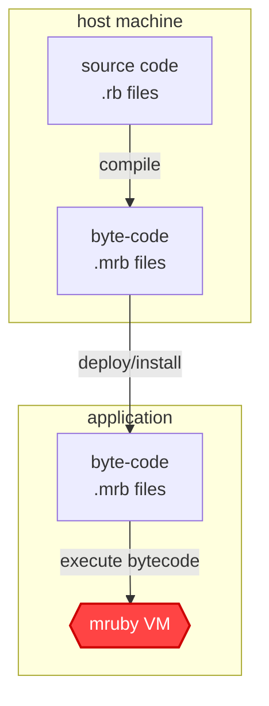

# mruby/cs

MRubyCS is a pure C# [mruby](https://github.com/mruby/mruby) virtual machine implementation  It combines high Ruby-level compatibility with the performance and extensibility of modern C#. 

Easily embed Ruby into Unity or .NET—empowering users to script game logic while keeping your core engine in C#.

> [!NOTE]
> [VitalRouter.MRuby](https://github.com/hadashiA/VitalRouter) provides a high-level framework for integrating MRubyCS with Unity (and .NET), including command routing and script lifecycle management.

## Why mruby?

Ruby's elegant, expressive syntax makes it ideal for building DSLs (Domain-Specific Languages). Game designers and scenario writers can describe complex game logic — event triggers, dialogue trees, AI behavior — in clean, readable scripts without wrestling with C-like syntax.

```ruby
# Example: game event DSL
scene :throne_room_betrayal do
  sequence do
    camera.focus_on :king, over: 1.2.seconds
    king.say "You have served me well, knight."
    wait 0.5.seconds
    advisor.move_to :behind_king
    advisor.say "Too well, perhaps."

    choice do
      option "Draw your sword" do
        player.equip :longsword
        goto :combat_phase
      end

      option "Kneel" do
        player.animate :kneel
        king.say "Loyalty. How rare."
        complete_scene
      end
    end
  end
end
```

> [!NOTE]
> [Presentation at RubyKaigi 2026](https://speakerdeck.com/hadashia/mruby-on-c-number-from-vm-implementation-to-game-scripting)

## Features

- Support mruby 4.0 bytecode.
- **Pure C# implementation/Zero native dependencies mruby VM** — runs anywhere Unity/.NET runs. No per-platform native builds to maintain.
- **High performance** — leverages .NET JIT, GC, and modern C# optimizations with minimal overhead.
- **Ruby compatible** — all opcodes implemented; passes mruby's official test suite
  - [Syntax](https://github.com/hadashiA/MRubyCS/blob/main/tests/MRubyCS.Tests/ruby/test/syntax.rb), [Literals](https://github.com/hadashiA/MRubyCS/blob/main/tests/MRubyCS.Tests/ruby/test/literals.rb), [Lang](https://github.com/hadashiA/MRubyCS/blob/main/tests/MRubyCS.Tests/ruby/test/lang.rb), [Methods](https://github.com/hadashiA/MRubyCS/blob/main/tests/MRubyCS.Tests/ruby/test/methods.rb), [Module](https://github.com/hadashiA/MRubyCS/blob/main/tests/MRubyCS.Tests/ruby/test/module.rb), [Exception](https://github.com/hadashiA/MRubyCS/blob/main/tests/MRubyCS.Tests/ruby/test/exception.rb), ...
  - Supported Types: [Array](https://github.com/hadashiA/MRubyCS/blob/main/tests/MRubyCS.Tests/ruby/test/array.rb), [Class](https://github.com/hadashiA/MRubyCS/blob/main/tests/MRubyCS.Tests/ruby/test/class.rb), [Enumerator](https://github.com/hadashiA/MRubyCS/blob/main/tests/MRubyCS.Tests/ruby/test/enumerator.rb), [Fiber](https://github.com/hadashiA/MRubyCS/blob/main/tests/MRubyCS.Tests/ruby/test/fiber.rb), [Float](https://github.com/hadashiA/MRubyCS/blob/main/tests/MRubyCS.Tests/ruby/test/float.rb), [Hash](https://github.com/hadashiA/MRubyCS/blob/main/tests/MRubyCS.Tests/ruby/test/hash.rb), [Integer](https://github.com/hadashiA/MRubyCS/blob/main/tests/MRubyCS.Tests/ruby/test/integer.rb), [Module](https://github.com/hadashiA/MRubyCS/blob/main/tests/MRubyCS.Tests/ruby/test/module.rb), [Nil](https://github.com/hadashiA/MRubyCS/blob/main/tests/MRubyCS.Tests/ruby/test/nil.rb), [Proc](https://github.com/hadashiA/MRubyCS/blob/main/tests/MRubyCS.Tests/ruby/test/proc.rb), [Random](https://github.com/hadashiA/MRubyCS/blob/main/tests/MRubyCS.Tests/ruby/test/random.rb), [Range](https://github.com/hadashiA/MRubyCS/blob/main/tests/MRubyCS.Tests/ruby/test/range.rb), [Symbol](https://github.com/hadashiA/MRubyCS/blob/main/tests/MRubyCS.Tests/ruby/test/symbol.rb), [String](https://github.com/hadashiA/MRubyCS/blob/main/tests/MRubyCS.Tests/ruby/test/string.rb), [Time](https://github.com/hadashiA/MRubyCS/blob/main/tests/MRubyCS.Tests/ruby/test/time.rb)
  - Enumerable extensions ([mruby-enum-ext](https://github.com/hadashiA/MRubyCS/blob/main/tests/MRubyCS.Tests/ruby/test/enum_ext.rb)): `each_cons`, `each_slice`, `each_with_object`, `flat_map`, `group_by`, `sort_by`, `min_by`/`max_by`, `minmax`/`minmax_by`, `tally`, `filter_map`, `chunk`/`chunk_while`, `zip`, `to_h`, `uniq`, `cycle`, etc.
  - **Optional (opt-in)** — see [Optional Classes](#optional-classes-opt-in)
      - `Regexp` / `MatchData` (via `mrb.DefineRegexp()`)
      - `IO` / `File` / `IOError` (via `mrb.DefineIO()`)
- **Fiber & async/await integration** — suspend Ruby execution and await C# async methods without blocking threads.
- **Prism-based compiler** — uses [mruby-compiler2](https://github.com/picoruby/mruby-compiler2), the next-generation mruby compiler built on [Prism](https://github.com/ruby/prism) (the official CRuby parser), for more accurate and modern Ruby syntax support.

## Performance

In the .NET JIT environment, execution speeds are equal to or faster than the original native mruby.


The above results were obtained on macOS with Apple M4 over 10 iterations.

Please refer to the following for the [benchmark code](https://github.com/hadashiA/MRubyCS/tree/main/sandbox/MRubyCS.Benchmark).

## Limitations

- As of mruby 4.0, almost all bundled classes/methods are supported.
    - Support for extensions split into [mrbgems](https://github.com/mruby/mruby/tree/master/mrbgems) remains limited.
- `Regexp` and `IO` / `File` are **opt-in**: `MRubyState.Create()` doesn't register them, so embedding hosts that don't need them aren't paying for it. Call `mrb.DefineRegexp()` / `mrb.DefineIO()` to add them. See [Optional Classes](#optional-classes-opt-in).

## Table of Contents

- [Installation](#installation)
    - [NuGet](#nuget)
    - [Unity](#unity)
- [Basic Usage](#basic-usage)
    - [Compiling and Executing Ruby Code](#compiling-and-executing-ruby-code)
        - [Option A: Pre-compile bytecode](#option-a-pre-compile-bytecode)
        - [Option B: Using Compiler library (runtime compile)](#option-b-using-compiler-library-runtime-compile)
        - [Irep](#irep)
        - [Compiler Reference](#compiler-reference)
    - [Define ruby class/module/method by C#](#define-ruby-classmodulemethod-by-c)
        - [Error handling & validation in C# methods](#error-handling--validation-in-c-methods)
        - [Constants](#constants)
    - [Call ruby method from C# side](#call-ruby-method-from-c-side)
        - [Send with block / keyword arguments](#send-with-block--keyword-arguments)
        - [Type conversion & introspection](#type-conversion--introspection)
        - [Instance variables / class variables / global variables](#instance-variables--class-variables--global-variables)
        - [Clone / Dup / Freeze](#clone--dup--freeze)
    - [MRubyValue](#mrubyvalue)
        - [Symbol/String](#symbolstring)
        - [Array/Hash](#arrayhash)
        - [Embedded custom C# data into MRubyValue](#embedded-custom-c-data-into-mrubyvalue)
- [Optional Classes (opt-in)](#optional-classes-opt-in)
    - [Regexp](#regexp)
    - [IO / File](#io--file)
- [Fiber (Coroutine)](#fiber-coroutine)
- [Define async Ruby method (FiberScheduler)](#define-async-ruby-method-fiberscheduler)
    - [Default behavior (no scheduler)](#default-behavior-no-scheduler)
    - [With a scheduler installed](#with-a-scheduler-installed)
    - [Combining C# `async`/`await` with `Suspend`](#combining-c-asyncawait-with-suspend)
    - [Stream I/O hooks](#stream-io-hooks-readstream--readstreamtoend--writestream)
    - [Built-in Schedulers](#built-in-schedulers)
    - [Custom Schedulers](#custom-schedulers)
- [MRubyCS.Serializer](#mrubycsserializer)

## Installation

> [!WARNING]
> The current version supports mruby 4.0 bytecode.
> Versions 0.70.0 and older supported mruby 3.0 bytecode.
> If you have bytecode from an older MRubyCS.Compiler (or mrbc), please regenerate it with the latest version.

### NuGet

| Package   | Description    | Latest version |
|:----------|:---------------|----------------|
| MRubyCS   |  Main package. A mruby vm implementation. | [](https://www.nuget.org/packages/MRubyCS) |
| MRubyCS.Compiler | Compile ruby source code utility. (Native binding)  | [](https://www.nuget.org/packages/MRubyCS.Compiler)   |
| MRubyCS.Compiler.Cli | dotnet tool for compiling Ruby source to bytecode | [](https://www.nuget.org/packages/MRubyCS.Compiler.Cli) |
| MRubyCS.Serializer  | Converting Ruby and C# Objects Between Each Other | [](https://www.nuget.org/packages/MRubyCS.Serializer)  |

### Unity

> [!NOTE]
> Requirements: Unity 2021.3 or later.

1. Install [NuGetForUnity](https://github.com/GlitchEnzo/NuGetForUnity).
2. Install following packages via NugetForUnity
    - Utf8StringInterpolation
    - MRubyCS
    - (Optional) MRubyCS.Serializer
3. (Optional) To install utilities for generating mrb bytecode, refer to the [Compiling and Executing Ruby Code](#compiling-and-executing-ruby-code) section.

## Basic Usage

### Compiling and Executing Ruby Code

mruby allows the compiler and runtime to be separated. By distributing only precompiled bytecode, you can keep the mruby compiler out of your production deployment.


```mermaid
graph TB
    subgraph host["host machine"]
        A[source code<br/>.rb files]
        C[byte-code<br/>.mrb files]
        A -->|compile| C
    end
    C -->|deploy/install| E
    subgraph application["application"]
        D{{mruby VM}}
        E[byte-code<br>.mrb files]
        E -->|execute bytecode| D
    end

    style D fill:#ff4444,stroke:#cc0000,color:#ffffff,stroke-width:2px
```

You can choose whether to deploy precompiled bytecode or raw source code:

- Bytecode only:
    - extremely compact and recommended for production environments.
- Source code:
    - compiled on the target machine.
    - Note that compilation relies on the native compiler, so supported platforms are limited to those where mruby-compiler runs.

> [!TIP]
> Option A is recommended for production. Option B is convenient for development and prototyping.

#### Option A: Pre-compile bytecode

Pre-compile Ruby source to `.mrb` bytecode with the CLI tool:

```bash
dotnet tool install -g MRubyCS.Compiler.Cli
mruby-compiler fibonacci.rb -o fibonacci.mrb
```

Or with the C# API:

```cs
using MRubyCS;
using MRubyCS.Compiler;

var mrb = MRubyState.Create();
var compiler = MRubyCompiler.Create(mrb);

var source = """
    def fibonacci(n)
      return n if n <= 1
      fibonacci(n - 1) + fibonacci(n - 2)
    end

    fibonacci 10
    """u8;

// Compile and save as .mrb file
using var compilation = compiler.Compile(source);
File.WriteAllBytes("fibonacci.mrb", compilation.AsBytecode());
```

Then execute the pre-compiled bytecode:

```cs
using MRubyCS;

var mrb = MRubyState.Create();
var bytecode = File.ReadAllBytes("/path/to/fibonacci.mrb");
var result = mrb.LoadBytecode(bytecode);

result.IntegerValue //=> 55
```

#### Option B: Using Compiler library (runtime compile)

```bash
dotnet add package MRubyCS
dotnet add package MRubyCS.Compiler
```

```cs
using MRubyCS;
using MRubyCS.Compiler;

var mrb = MRubyState.Create();
var compiler = MRubyCompiler.Create(mrb);

var result = compiler.LoadSourceCode("""
    def fibonacci(n)
      return n if n <= 1
      fibonacci(n - 1) + fibonacci(n - 2)
    end

    fibonacci 10
    """u8);

result.IntegerValue //=> 55
```

See also [MRubyCS.Compiler (library)](#mrubycscompiler-library) for installation details.

#### Irep

You can also parse bytecode in advance. The result is called `Irep` in mruby terminology. Pre-parsing is useful when you want to execute the same bytecode multiple times without re-parsing overhead.

```cs
Irep irep = mrb.ParseBytecode(bytecode);
mrb.Execute(irep);
```

`Irep` can be executed as is, or converted to `Proc`, `Fiber` before use. For details on Fiber, refer to the [Fiber](#fiber-coroutine) section.

> [!NOTE]
> - **`Dispose` when finished** — `MRubyState` is `IDisposable`. The VM itself has no unmanaged resources, but an installed `IMRubyFiberScheduler` may hold OS timers / cancellation tokens; `Dispose` cleans those up. A finalizer is in place as a backstop, but explicit disposal is preferred. If you never call `SetFiberScheduler`, omitting `Dispose` is harmless.
> - **Not thread-safe** — each `MRubyState` instance must be used from a single thread. For multi-threaded scenarios, create a separate instance per thread.

---

#### Compiler Reference

The MRubyCS runtime is pure C#, but the mrb compiler uses the native prism compiler.
Note that the compiler's supported target platforms are subject to the following limitations.

| OS      | Architecture |
|:--------|:-------------|
| Linux   | x64, arm64   |
| macOS   | x64, arm64   |
| Windows | x64          |

##### MRubyCS.Compiler.Cli (dotnet tool)

The `mruby-compiler` CLI supports additional output formats beyond simple `.mrb`:

```bash
# Dump bytecode in human-readable format
$ mruby-compiler input.rb --dump

# Generate C# code with embedded bytecode
$ mruby-compiler input.rb -o Bytecode.cs --format csharp --csharp-namespace MyApp
```

> [!TIP]
> For local tool installation, use `dotnet tool install MRubyCS.Compiler.Cli` and run with `dotnet mruby-compiler`.

| Option | Description |
|:-------|:------------|
| `-o`, `--output` | Output file path (default: same directory as input with `.mrb`/`.cs` extension). Use `-` for stdout. |
| `--dump` | Dump bytecode in human-readable format (outputs to stdout) |
| `--format` | Output format: `binary` (default) or `csharp` |
| `--csharp-namespace` | C# namespace for generated code (used with `--format csharp`) |
| `--csharp-class-name` | C# class name for generated code (used with `--format csharp`) |

##### mrbc (original mruby compiler)

Alternatively, you can use the original [mruby](https://github.com/mruby/mruby) project's compiler.

```bash
$ git clone git@github.com:mruby/mruby.git
$ cd mruby
$ rake
$ ./build/host/bin/mrbc -o output.mrb input.rb
```

##### MRubyCS.Compiler (library)

`MRubyCS.Compiler` is a thin wrapper of the C# API for the native compiler.

```bash
dotnet add package MRubyCS.Compiler
```

**Unity**: Open the Package Manager window by selecting Window > Package Manager, then click on [+] > Add package from git URL and enter the following URL:

```
https://github.com/hadashiA/MRubyCS.git?path=src/MRubyCS.Unity/Assets/MRubyCS.Compiler.Unity#0.50.3
```

```cs
using MRubyCS.Compiler;

var source = """
def f(a)
  1 * a
end

f 100
"""u8;

var mrb = MRubyState.Create();
var compiler = MRubyCompiler.Create(mrb);

// Compile source code (returns CompilationResult)
using var compilation = compiler.Compile(source);

// Convert to irep (internal executable representation)
var irep = compilation.ToIrep();

// irep can be used later..
var result = mrb.Execute(irep); // => 100

// Or, get bytecode (mruby calls this format "Rite")
// bytecode can be saved to a file or any other storage
File.WriteAllBytes("compiled.mrb", compilation.AsBytecode());

// Can be used later from file
mrb.LoadBytecode(File.ReadAllBytes("compiled.mrb")); //=> 100

// or, you can evaluate source code directly
result = compiler.LoadSourceCode("f(100)"u8);
result = compiler.LoadSourceCode("f(100)");
```

##### Unity AssetImporter

In Unity, if you install this extension, importing a .rb text file will generate .mrb bytecode as a subasset.

For example, importing the text file `hoge.rb` into a project will result in the following.


This subasset is a `TextAsset` that can be assigned via the inspector or loaded from code:

``` cs
var mrb = MRubyState.Create();

var bytecodeAsset = (TextAsset)AssetDatabase.LoadAllAssetsAtPath("Assets/hoge.rb")
       .First(x => x.name.EndsWith(".mrb"));
mrb.LoadBytecode(bytecodeAsset.GetData<byte>().AsSpan());
```

To read a subasset in Addressables, you would do the following.

```cs
Addressables.LoadAssetAsync<TextAsset>("Assets/hoge.rb[hoge.mrb]")
```

### Define ruby class/module/method by C#

```cs
var classA = mrb.DefineClass(mrb.Intern("A"u8), c =>
{
    c.DefineMethod(mrb.Intern("plus100"u8), (_, self) =>
    {
        var arg0 = mrb.GetArgumentAsIntegerAt(0);
        return arg0 + 100;
    });
});
```

```ruby
a = A.new
a.plus100(123) #=> 223
```

#### Block / keyword / rest arguments

Methods can also receive blocks, keyword arguments, and rest arguments:

```cs
var classA = mrb.DefineClass(mrb.Intern("A"u8), c =>
{
    // Block argument
    c.DefineMethod(mrb.Intern("with_block"u8), (_, self) =>
    {
        var arg0 = mrb.GetArgumentAt(0);
        var blockArg = mrb.GetBlockArgument();
        if (!blockArg.IsNil)
        {
            mrb.Send(blockArg, mrb.Intern("call"u8), arg0);
        }
    });

    // Keyword and rest arguments
    c.DefineMethod(mrb.Intern("with_kwargs"u8), (_, self) =>
    {
        var keywordArg = mrb.GetKeywordArgument(mrb.Intern("foo"u8));
        mrb.EnsureValueType(keywordArg, MRubyVType.Integer);

        var restArguments = mrb.GetRestArgumentsAfter(0);
        for (var i = 0; i < restArguments.Length; i++)
        {
            Console.WriteLine($"rest arg({i}: {restArguments[i]})");
        }
    });
});
```

#### Class methods / modules

```cs
// Class method
var classA = mrb.DefineClass(mrb.Intern("A"u8), c =>
{
    c.DefineClassMethod(mrb.Intern("greet"u8), (_, self) =>
    {
        return mrb.NewString("hello"u8);
    });
});

// Monkey patching — add methods after class definition
classA.DefineMethod(mrb.Intern("extra"u8), (_, self) => { /* ... */ });

// Define module and include
var moduleA = mrb.DefineModule(mrb.Intern("ModuleA"u8));
mrb.DefineMethod(moduleA, mrb.Intern("module_method"u8), (_, self) => 123);
mrb.IncludeModule(classA, moduleA);
```

```ruby
A.greet          #=> "hello"
A.new.extra
A.new.module_method #=> 123
```

#### Error handling & validation in C# methods

Inside C#-defined methods, you can raise Ruby exceptions and validate arguments:

```cs
var myClass = mrb.DefineClass(mrb.Intern("MyClass"u8));

mrb.DefineMethod(myClass, mrb.Intern("safe_divide"u8), (s, self) =>
{
    s.EnsureArgumentCount(2, 2); // require exactly 2 arguments

    var a = s.GetArgumentAsIntegerAt(0);
    var b = s.GetArgumentAsIntegerAt(1);

    if (b == 0)
    {
        s.Raise(s.StandardErrorClass, "division by zero"u8);
    }
    return a / b;
});
```

```cs
// Available validation helpers
mrb.EnsureArgumentCount(min, max);               // check argument count
mrb.EnsureValueType(value, MRubyVType.Integer);  // check value type
mrb.EnsureBlockGiven(block);                     // check block is provided
mrb.EnsureNotFrozen(value);                      // check object is not frozen

// Raise Ruby exceptions
mrb.Raise(mrb.StandardErrorClass, "message"u8);
mrb.Raise(mrb.ExceptionClass, mrb.NewString($"detail: {info}"));
```

To catch Ruby exceptions raised during execution on the C# side:

```cs
try
{
    mrb.Send(obj, mrb.Intern("may_raise"u8));
}
catch (MRubyRaiseException ex)
{
    Console.WriteLine($"Ruby exception: {ex.Message}");
}
```

#### Constants

```cs
// Define a constant under Object (global)
mrb.DefineConst(mrb.Intern("MAX_SIZE"u8), 1024);

// Define a constant under a specific class/module
mrb.DefineConst(myClass, mrb.Intern("VERSION"u8), mrb.NewString("1.0"u8));

// Check if a constant exists
mrb.ConstDefinedAt(mrb.Intern("MAX_SIZE"u8));                         //=> true
mrb.ConstDefinedAt(mrb.Intern("VERSION"u8), myClass);                 //=> true
mrb.ConstDefinedAt(mrb.Intern("VERSION"u8), myClass, recursive: true); // search ancestors

// Safe lookup
if (mrb.TryGetConst(mrb.Intern("MAX_SIZE"u8), out var constValue))
{
    // use constValue...
}
```

### Call ruby method from C# side

Use `mrb.Send()` to call Ruby methods from C#:

```cs
// Call a class method
var classA = mrb.GetConst(mrb.Intern("A"u8), mrb.ObjectClass);
mrb.Send(classA, mrb.Intern("foo="u8), 123);
mrb.Send(classA, mrb.Intern("foo"u8)); //=> 123

// Call a global-scope method — use TopSelf as the receiver
mrb.Send(mrb.TopSelf, mrb.Intern("puts"u8), mrb.NewString("hello"u8));

// Access instance variables
var instanceB = mrb.GetInstanceVariable(mrb.TopSelf, mrb.Intern("@b"u8));
mrb.Send(instanceB, mrb.Intern("bar="u8), 456);
mrb.Send(instanceB, mrb.Intern("bar"u8)); //=> 456

// Resolve nested constants
var classC = mrb.Send(mrb.ObjectClass, mrb.Intern("const_get"u8), mrb.NewString("M::C"u8));
```

<details>
<summary>Ruby code assumed by the examples above</summary>

```ruby
class A
  def self.foo = @@foo

  def self.foo=(x)
    @@foo = x
  end
end

class B
  attr_accessor :bar
end
@b = B.new

module M
  class C
    def self.foo = 999
  end
end
```
</details>

#### Send with block / keyword arguments

```cs
// Send with a block (RProc)
var proc = mrb.CreateProc(irep);
mrb.Send(obj, mrb.Intern("each"u8), proc);

// Send with keyword arguments
mrb.Send(
    obj,
    mrb.Intern("configure"u8),
    args: [],
    kargs: [new(mrb.Intern("verbose"u8), MRubyValue.True)],
    block: null);
```

> [!WARNING]
> **Unity**: The `Send` overload with `params ReadOnlySpan<MRubyValue>` is not supported because Unity's C# compiler does not support `params ReadOnlySpan<T>`. You must explicitly allocate an array instead:
> ```cs
> // This does NOT compile in Unity:
> // mrb.Send(klass, sym, arg0, arg1);
>
> // Use an explicit array:
> mrb.Send(klass, sym, new MRubyValue[] { arg0, arg1 });
> ```
> The single-argument overload `Send(self, methodId, arg0)` works without this workaround.

#### Type conversion & introspection

The following examples use `value`, `a`, `b` as `MRubyValue` instances obtained from prior operations (e.g. `Send`, `LoadBytecode`).

```cs
// Convert values (calls Ruby's to_i / to_f / to_sym internally)
long   i = mrb.AsInteger(value);
double f = mrb.AsFloat(value);
Symbol s = mrb.AsSymbol(value);

// Convert to string (Ruby's to_s / inspect)
RString str     = mrb.Stringify(value);  // to_s
RString inspect = mrb.Inspect(value);    // inspect

// Class introspection
RClass  klass = mrb.ClassOf(value);
RString name  = mrb.ClassNameOf(value);

// Type checking (Ruby's instance_of? / kind_of?)
mrb.InstanceOf(value, mrb.StringClass);  //=> true if exact class
mrb.KindOf(value, mrb.ObjectClass);      //=> true if class or ancestor

// Equality and comparison (calls Ruby's == / <=>)
mrb.ValueEquals(a, b);   //=> true/false
mrb.ValueCompare(a, b);  //=> -1, 0, 1

// Check if method exists (Ruby's respond_to?)
mrb.RespondTo(value, mrb.Intern("to_s"u8)); //=> true
```

#### Instance variables / class variables / global variables

```cs
// Instance variables
mrb.SetInstanceVariable(obj, mrb.Intern("@name"u8), mrb.NewString("Alice"u8));
var name = mrb.GetInstanceVariable(obj, mrb.Intern("@name"u8));
mrb.RemoveInstanceVariable(obj, mrb.Intern("@name"u8));

// Class variables
mrb.SetClassVariable(myClass, mrb.Intern("@@count"u8), 0);
var count = mrb.GetClassVariable(myClass, mrb.Intern("@@count"u8));

// Global variables (the symbol name includes the leading `$`)
mrb.SetGlobalVariable(mrb.Intern("$game_map"u8), gameMapValue);
var gameMap = mrb.GetGlobalVariable(mrb.Intern("$game_map"u8)); // returns nil if undefined
mrb.GlobalVariableDefined(mrb.Intern("$game_map"u8));            //=> true
mrb.RemoveGlobalVariable(mrb.Intern("$game_map"u8), out _);
```

#### Clone / Dup / Freeze

```cs
// Clone (deep copy with singleton class)
var cloned = mrb.CloneObject(value);

// Dup (shallow copy)
var duped = mrb.DupObject(value);

// Freeze an object (RObject level)
var str = mrb.NewString("immutable"u8);
str.MarkAsFrozen();
str.IsFrozen //=> true
```

### `MRubyValue`

`MRubyValue` represents a Ruby value. It is returned from methods like `LoadBytecode`, `Execute`, `Send`, etc.

```cs
value.IsNil //=> true if `nil`
value.IsInteger //=> true if integer
value.IsFloat //=> true if float
value.IsSymbol //=> true if Symbol
value.IsObject //=> true if any allocated object type

value.VType //=> get known ruby-type as C# enum.

value.IntegerValue //=> get as C# Int64
value.FloatValue //=> get as C# float
value.SymbolValue //=> get as `Symbol`

value.As<RString>() //=> get as internal String representation
value.As<RArray>() //=> get as internal Array representation
value.As<RHash>() //=> get as internal Hash representation

// pattern matching
if (value.Object is RString str)
{
    // ...
}

switch (value)
{
    case { IsInteger: true }:
        // ...
        break;
    case { Object: RString str }:
        // ...
        break;
}

// Creating MRubyValue
var intValue = new MRubyValue(100);
var floatValue = new MRubyValue(1.234f);
var objValue = new MRubyValue(str);

// Implicit conversions are available — useful when passing arguments
mrb.Send(obj, mrb.Intern("method"u8), 42);       // int → MRubyValue
mrb.Send(obj, mrb.Intern("method"u8), 3.14);      // double → MRubyValue
mrb.Send(obj, mrb.Intern("method"u8), true);       // bool → MRubyValue
mrb.Send(obj, mrb.Intern("method"u8), sym);        // Symbol → MRubyValue
mrb.Send(obj, mrb.Intern("method"u8), rstring);    // RObject → MRubyValue

// Static constants
MRubyValue.Nil   // Ruby nil
MRubyValue.True  // Ruby true
MRubyValue.False // Ruby false

// Boolean / truthiness
value.BoolValue //=> C# bool
value.Truthy    //=> true unless nil or false (Ruby semantics)
value.Falsy     //=> true if nil or false
```

#### Symbol/String

The string representation within mruby is utf8.
Therefore, to generate a ruby string from C#, [Utf8StringInterpolation](https://github.com/Cysharp/Utf8StringInterpolation) is used internally.


```cs
// Create string literal.
var str1 = mrb.NewString("HOGE HOGE"u8); // use u8 literal (C# 11 or newer)
var str2 = mrb.NewString($"FOO BAR"); // use string interpolation

var x = 123;
var str3 = mrb.NewString($"x={x}");

// wrap MRubyValue..
MRubyValue strValue = str1;
```

There is a concept in mruby similar to String called `Symbol`.
Like String, it is created using utf8 strings, but internally it is a uint integer.
Symbols are usually used for method IDs and class IDs.

To create a symbol from C#, use `Intern`.

```cs
// symbol literal
var sym1 = mrb.Intern("sym");

// create symbol from string interporation
var x = 123;
var sym2 = mrb.Intern($"sym{x}");

// symbol to utf8 bytes
mrb.NameOf(sym1); //=> "sym"u8
mrb.NameOf(sym2); //=> "sym123"u8

// create symbol from string
var sym2 = mrb.AsSymbol(mrb.NewString($"hoge"));
```

> [!NOTE]
> Both `Intern("str")` and `Intern("str"u8)` are valid, but the u8 literal is faster. We recommend using the u8 literal whenever possible.

`RString` also provides methods for in-place manipulation and direct UTF-8 byte access:

```cs
var str = mrb.NewString("hello"u8);

// UTF-8 byte access
ReadOnlySpan<byte> bytes = str.AsSpan(); // raw UTF-8 bytes

// In-place modification
str.Concat(" world"u8);  // append bytes
str.Upcase();             // "HELLO WORLD"
str.Downcase();           // "hello world"
str.Capitalize();         // "Hello world"
str.Chomp();              // remove trailing newline
str.Chop();               // remove last character
```

#### Array/Hash

`RArray` and `RHash` are the internal representations of Ruby's `Array` and `Hash`.

```cs
// Create array
var array = mrb.NewArray(3); // with capacity
var array2 = mrb.NewArray(1, 2, 3);

// Access elements (supports negative indices)
var first = array2[0];   //=> 1
var last  = array2[-1];  //=> 3

// Add elements
array.Push(100);
array.Push(200);

// Get length
array.Length //=> 2

// Iterate over elements
foreach (var item in array)
{
    Console.WriteLine(item.IntegerValue);
}

// Pop / Shift
if (array.TryPop(out var popped)) { /* ... */ }
var shifted = array.Shift(); // remove and return first element

// Extract RArray from MRubyValue
var value = mrb.LoadBytecode(bytecode); // returns MRubyValue
var arr = value.As<RArray>();
```

```cs
// Create hash
var hash = mrb.NewHash();

// Set values (key can be any MRubyValue — Symbol, String, Integer, etc.)
hash[mrb.Intern("name"u8)] = mrb.NewString("Alice"u8);
hash[mrb.Intern("age"u8)]  = 30;

// Get values
var name = hash[mrb.Intern("name"u8)];

// Check existence
hash.ContainsKey(mrb.Intern("name"u8)); //=> true
hash.TryGetValue(mrb.Intern("age"u8), out var age); //=> true, age = 30

// Get length
hash.Length //=> 2

// Iterate over key-value pairs
foreach (var kv in hash)
{
    // kv.Key, kv.Value are MRubyValue
}

// Delete
hash.TryDelete(mrb.Intern("age"u8), out var deleted);

// Extract RHash from MRubyValue
var hashValue = mrb.LoadBytecode(bytecode);
var h = hashValue.As<RHash>();
```

#### Embedded custom C# data into MRubyValue

You can stuff any C# object into an `MRubyValue` via `RData`. The `RData.Data` property accepts any `object` and can be freely get/set from C#.

This is useful when calling C# functionality from Ruby methods defined in C#.

```cs
class YourCustomClass
{
    public string Value { get; set; }
}

var csharpInstance = new YourCustomClass { Value = "abcde" };

var mrb = MRubyState.Create();

var data = new RData(csharpInstance);
mrb.SetConst(mrb.Intern("MYDATA"u8), mrb.ObjectClass, data);

// Use custom data from ruby
mrb.DefineMethod(mrb.ObjectClass, mrb.Intern("from_csharp_data"u8), (_, self) =>
{
    var dataValue = mrb.GetConst(mrb.Intern("MYDATA"u8), mrb.ObjectClass);
    var csharpInstance = dataValue.As<RData>().Data as YourCustomClass;
    // ...
});
```

#### Embedded custom C# data with ruby class

```cs
// Instances of classes that specify `MRubyVType.CSharpData` have `self` as RData.
var yourClass = mrb.DefineClass(mrb.Intern("MyCustomClass"u8), mrb.ObjectClass, MRubyVType.CSharpData);

// Define custom `initialize` with C# data
mrb.DefineMethod(yourClass, mrb.Intern("initialize"u8), (s, self) =>
{
    if (self.Object is RData x)
    {
        x.Data = new YourCustomClass { Value = "abcde" };
    }
    return self;
});

// Use custom C# data
mrb.DefineMethod(yourClass, mrb.Intern("foo_method"u8), (s, self) =>
{
    if (self.Object is RData { Data: YourCustomClass csharpInstance })
    {
        // Use C# data..
        csharpInstance.Value = "fghij";
    }
    // ...
});

```


## Optional Classes (opt-in)

Some bundled classes are **not** registered by `MRubyState.Create()` so that embedding hosts only pay for the surface area they actually need. Enable them explicitly per `MRubyState` instance:

| Class | Enable with | Adds |
|---|---|---|
| `Regexp` | `mrb.DefineRegexp()` | `Regexp`, `MatchData`, and `String#=~` / `#match` / `#sub` / `#gsub` / `#scan` / `#index` |
| `IO` / `File` | `mrb.DefineIO()` | `IO`, `File`, `IOError` |

Both calls are idempotent and must be made **before** compiling/running Ruby code that references the classes.

```cs
using var mrb = MRubyState.Create();
mrb.DefineRegexp();
mrb.DefineIO();
using var compiler = MRubyCompiler.Create(mrb);
```

### Regexp

Once enabled, both literal `/.../` regular expressions and `Regexp.new` are available, along with `MatchData` and the regexp-related `String` methods.

```cs
using var mrb = MRubyState.Create();
mrb.DefineRegexp();
using var compiler = MRubyCompiler.Create(mrb);

compiler.LoadSourceCode("""
    re = /(\w+)@(\w+\.\w+)/
    if m = "contact: alice@example.com".match(re)
      puts m[0]        # => "alice@example.com"
      puts m[1]        # => "alice"
      puts m[2]        # => "example.com"
    end

    # case-insensitive flag via Regexp.new
    Regexp.new("hello", Regexp::IGNORECASE) =~ "HELLO"   # => 0

    # sub / gsub / scan
    "foo bar foo".gsub(/foo/, "baz")     # => "baz bar baz"
    "a1 b2 c3".scan(/[a-z]\d/)           # => ["a1", "b2", "c3"]
    """u8);
```

### IO / File

`File.read` / `File.write` provide a quick round-trip; `File.open` returns an `IO`/`File` instance for streaming reads and writes. `IOError` is raised when operating on a closed handle.

```cs
using var mrb = MRubyState.Create();
mrb.DefineIO();
using var compiler = MRubyCompiler.Create(mrb);

compiler.LoadSourceCode("""
    File.write("/tmp/greeting.txt", "hello world")
    puts File.read("/tmp/greeting.txt")    # => "hello world"
    puts File.exist?("/tmp/greeting.txt")  # => true

    f = File.open("/tmp/greeting.txt")
    begin
      puts f.read
    ensure
      f.close
    end
    """u8);
```

When a `FiberScheduler` is installed, `IO`/`File` reads and writes route through the scheduler's stream hooks instead of blocking the host thread. See [Stream I/O hooks](#stream-io-hooks-readstream--readstreamtoend--writestream) for details.


## Fiber (Coroutine)

MRubyCS supports Ruby Fibers, which are lightweight concurrency primitives that allow you to pause and resume code execution. In addition to standard Ruby Fiber features, MRubyCS provides seamless integration with C#'s async/await pattern.

### Basic Fiber Usage

```cs
using MRubyCS;
using MRubyCS.Compiler;

// Create state and compiler
var mrb = MRubyState.Create();
var compiler = MRubyCompiler.Create(mrb);

// Define a fiber that yields values
var code = """
    Fiber.new do |x|
      Fiber.yield(x * 2)
      Fiber.yield(x * 3)
      x * 4
    end
    """u8;

// Load the Ruby code as a Fiber
using var compilation = compiler.Compile(code);
var fiber = mrb.Execute(compilation.ToIrep()).As<RFiber>();

// Resume the fiber with initial value
var result1 = fiber.Resume(10);  // => 20

var result2 = fiber.Resume(10);  // => 30

var result3 = fiber.Resume(10);  // => 40 (final return value)

// Check if fiber is still alive
fiber.IsAlive  // => false
```

If you want to execute arbitrary code snippets as fibers, do the following.

```cs
var code = """
  x = 1
  y = 2
  Fiber.yield (x + y) * 100
  Fiber.yield (x + y) * 200
"""u8;

var fiber = compiler.LoadSourceCodeAsFiber(code);

// `LoadSourceCodeAsFiber` is same as:
// using var compilation = compiler.Compile(code);
// var proc = mrb.CreateProc(compilation.ToIrep());
// var fiber = mrb.CreateFiber(proc);

fiber.Resume(); //=> 300
fiber.Resume(); //=> 600
```

### Async/Await Integration

MRubyCS provides unique C# async integration features for working with Fibers:

```cs
// Wait for fiber to terminate
var code = """
    Fiber.new do |x|
      Fiber.yield
      Fiber.yield
      "done"
    end
    """u8;

using var compilation = compiler.Compile(code);
var fiber = mrb.Execute(compilation.ToIrep()).As<RFiber>();

// Start async wait before resuming
var terminateTask = fiber.WaitForTerminateAsync();

// Resume the fiber multiple times
fiber.Resume();
fiber.Resume();
fiber.Resume();

// Wait for completion
await terminateTask;
Console.WriteLine("Fiber has terminated");
```

You can consume fiber results as async enumerable:

```cs
var code = """
    Fiber.new do |x|
      3.times do |i|
        Fiber.yield(x * (i + 1))
      end
    end
    """u8;

using var compilation = compiler.Compile(code);
var fiber = mrb.Execute(compilation.ToIrep()).As<RFiber>();

// Process each yielded value asynchronously
await foreach (var value in fiber.AsAsyncEnumerable())
{
    Console.WriteLine($"Yielded: {value.IntegerValue}");
}
```

MRubyCS supports multiple consumers waiting for fiber results simultaneously:

```cs
using var compilation = compiler.Compile(code);
var fiber = mrb.Execute(compilation.ToIrep()).As<RFiber>();

// Create multiple consumers
var consumer1 = Task.Run(async () =>
{
    while (fiber.IsAlive)
    {
        var result = await fiber.WaitForResumeAsync();
        Console.WriteLine($"Consumer 1 received: {result}");
    }
});

var consumer2 = Task.Run(async () =>
{
    while (fiber.IsAlive)
    {
        var result = await fiber.WaitForResumeAsync();
        Console.WriteLine($"Consumer 2 received: {result}");
    }
});

// Resume fiber and both consumers will receive the results
fiber.Resume(10);
fiber.Resume(20);
fiber.Resume(30);

await Task.WhenAll(consumer1, consumer2);
```

> [!CAUTION]
> Waiting for fiber can be performed in a separate thread.
> However, MRubyState and mruby methods are not thread-safe.
> Please note that when using mruby functions, you must always return to the original thread.

### Error Handling in Fibers

Exceptions raised within fibers are properly propagated:

```cs
var code = """
    Fiber.new do |x|
      Fiber.yield(x)
      raise "Something went wrong"
    end
    """u8;

using var compilation = compiler.Compile(code);
var fiber = mrb.Execute(compilation.ToIrep()).As<RFiber>();

// First resume succeeds
var result1 = fiber.Resume(10);  // => 10

// Second resume will throw
try
{
    fiber.Resume();
}
catch (MRubyRaiseException ex)
{
    Console.WriteLine($"Ruby exception: {ex.Message}");
}

// Async wait will also propagate the exception
var waitTask = fiber.WaitForResumeAsync();
try
{
    fiber.Resume();
    await waitTask;
}
catch (MRubyRaiseException ex)
{
    Console.WriteLine($"Async exception: {ex.Message}");
}
```

### yield/resume from C#

It is possible to resume/yield from a method defined in C#.

```cs
mrb.DefineMethod(mrb.FiberClass, mrb.Intern("resume_by_csharp"u8), (state, self) =>
{
    return self.As<RFiber>().Resume();
});
```

```ruby
 fiber = Fiber.new do
   3.times do
     Fiber.yield
   end
 end

 fiber.resume_by_csharp
```

## Define async Ruby method (FiberScheduler)

MRubyCS exposes a CRuby-style `Fiber::Scheduler` hook surface (`IMRubyFiberScheduler`) so that blocking Ruby primitives can cooperate with a C# async runtime instead of blocking the host thread. The hooks currently route the following primitives:

| Ruby primitive | Scheduler hook | Notes |
|---|---|---|
| `Kernel#sleep` | `KernelSleep` | `sleep 0` routes to `Yield` to avoid a Timer allocation |
| `Thread.pass` | `Yield` | Cooperative yield |
| `IO#read(n)` / `File.read` | `ReadStream` / `ReadStreamToEnd` | Resumes with a `String` of the read bytes (or `nil` at EOF for bounded reads) |
| `IO#write(s)` / `File.write` | `WriteStream` | Resumes with the bytes-written count as `Integer` |
| (host-defined) | `Suspend` → `FiberContinuation.Resume` | Park a fiber on an arbitrary external completion |

> [!NOTE]
> The `IO` / `File` classes are **opt-in** — `MRubyState.Create()` does NOT register them. Call `mrb.DefineIO()` before compiling/running Ruby code that uses them. Hosts that don't need stream/filesystem access can omit the call and the classes simply don't exist in Ruby.
>
> ```cs
> using var mrb = MRubyState.Create();
> mrb.DefineIO();   // adds IO, File, IOError
> ```

### Default behavior (no scheduler)

By default, no scheduler is installed. In this mode:

- `Kernel#sleep` calls `Thread.Sleep` and blocks the calling thread.
- `Thread.pass` is a no-op.
- `IO` / `File` reads & writes (when registered via `DefineIO()`) use synchronous `Stream.Read` / `Write`.
- `Fiber#resume` / `Fiber.yield` work exactly as in CRuby.
- The VM is fully synchronous from C#'s perspective.

```cs
var mrb = MRubyState.Create();
var compiler = MRubyCompiler.Create(mrb);

// Blocks the calling thread for 1 second.
compiler.LoadSourceCode("sleep 1; :done"u8);
```

This is the right default for CLI tools and tests that don't need cooperative scheduling.

### With a scheduler installed

`state.SetFiberScheduler(...)` swaps blocking primitives for cooperative ones. When a non-root fiber calls `sleep`, the VM yields back to its caller instead of blocking; the scheduler arranges for the fiber to be resumed when the deadline expires.

```cs
using var mrb = MRubyState.Create();
using var compiler = MRubyCompiler.Create(mrb);
mrb.SetFiberScheduler(new ThreadPoolFiberScheduler());

var fiber = compiler.LoadSourceCodeAsFiber("""
    sleep 0.05
    :done
    """u8);

fiber.Resume();
await fiber.WaitForTerminateAsync();
// `sleep` did not block any thread; the scheduler woke the fiber.
// `mrb.Dispose()` (the `using`) disposes the installed scheduler too.
```

> [!NOTE]
> `sleep` on the *root* fiber still falls back to `Thread.Sleep`, even when a scheduler is installed — there is no caller to yield to. The scheduler hooks only fire from inside `Fiber.new { ... }` bodies (including `LoadSourceCodeAsFiber`).

> [!IMPORTANT]
> `MRubyState` takes ownership of the installed scheduler: disposing the state disposes the scheduler too. Don't share a single scheduler instance across multiple `MRubyState`s.

### Combining C# `async`/`await` with `Suspend`

`Suspend` parks the current fiber and returns a `FiberContinuation` handle. The Ruby side stays suspended; the C# side completes async work off the VM thread and calls `continuation.Resume(value)` (or `SetCancelled` / `SetException`) — the value is delivered as the apparent return of the C# method that called `Suspend`.

```cs
mrb.SetFiberScheduler(new ThreadPoolFiberScheduler());

// Defines `await_http(url)` — fetches a URL without blocking the VM.
mrb.DefineMethod(mrb.KernelModule, mrb.Intern("await_http"u8), (state, _) =>
{
    var url = state.GetArgumentAsStringAt(0).ToString();
    var scheduler = state.FiberScheduler!;
    var continuation = scheduler.Suspend(); // yields the fiber internally

    _ = Task.Run(async () =>
    {
        try
        {
            using var client = new HttpClient();
            var body = await client.GetStringAsync(url);
            continuation.Resume(state.NewString(body));
        }
        catch (Exception ex) { continuation.SetException(ex); }
    });

    return MRubyValue.Nil; // unreached — continuation.Resume's value replaces this
});

var fiber = compiler.LoadSourceCodeAsFiber("""
    body = await_http("https://example.com")
    puts body.length
    """u8);
fiber.Resume();
await fiber.WaitForTerminateAsync();
```

Mechanics:

- `Suspend(mrb)` registers the parking state, then calls `Fiber.yield` to unwind the VM back to the caller of `Resume`. The returned `FiberContinuation` captures the parked fiber.
- `continuation.Resume(value)` schedules `fiber.Resume(value)`. The actual resume is deferred to the scheduler's preferred thread, so calling from inline ContinueWith or sync-completed task is safe.
- `continuation.SetCancelled()` resumes the fiber with `nil` (cancellation semantics).
- `continuation.SetException(ex)` injects `ex` as a Ruby exception on resume (catchable by `rescue`).
- Settling is **one-shot** — the first of Resume/SetCancelled/SetException wins; subsequent calls are no-op.
- The fiber is yielded *inside* `Suspend` — there's no "arrange-Resume-before-Suspend" race window like with the old `Block`/`Unblock` API.

### Stream I/O hooks (`ReadStream` / `ReadStreamToEnd` / `WriteStream`)

The bundled `IO` / `File` primitives — once registered via `mrb.DefineIO()` (see the opt-in note above) — delegate to specialized scheduler hooks for `Stream` reads and writes:

- `ReadStream(fiber, stream, maxBytes, ...)` — bounded read into a **scheduler-owned** buffer (rented from `ArrayPool<byte>.Shared`). Resumes the fiber with a `String` of the read bytes, or `nil` at EOF (matching `IO#read(n)`).
- `ReadStreamToEnd(fiber, stream, ...)` — unbounded read into a scheduler-owned growing buffer until EOF. Resumes with a `String` of the full content.
- `WriteStream(fiber, stream, data, ...)` — writes a `ReadOnlyMemory<byte>` to the stream; resumes with the bytes-written count as `Integer`.

All three accept an optional `disposeStream: true` flag — the scheduler disposes the stream after the I/O completes (before resume), convenient for `File.read` / `File.write` style operations.

**No user callback in the continuation chain.** Hosts cannot inject code between the scheduler's `await stream.ReadAsync(...)` and `fiber.Resume(...)`: the only thing that runs there is the scheduler's own `state.NewString(buffer)` call. This keeps thread-affinity control entirely in the scheduler. For operations that need richer host logic (HTTP clients, custom marshalling, etc.), use `Suspend` (above) and arrange the async work yourself.

```cs
// Host-defined: read up to n bytes from a custom stream.
mrb.DefineMethod(myStreamClass, mrb.Intern("read"u8), (state, self) =>
{
    var stream = self.As<MyStreamObject>().Stream;
    var n = (int)state.GetArgumentAsIntegerAt(0);
    state.FiberScheduler!.ReadStream(state.CurrentFiber, stream, n);
    return MRubyValue.Nil; // unreached on async path; the scheduler resumes with a String / nil
});
```

If the awaited task throws, the scheduler injects the exception so the fiber can `rescue` it:

```ruby
begin
  fetch_bytes("https://bad-host")
rescue => e
  puts e.message   # observes the host exception
end
```

### Built-in Schedulers

#### `ThreadPoolFiberScheduler`


Default implementation, shipped in the `MRubyCS` package. Backed by .NET `Task`s and `Timer`s; resumes fire on threadpool threads. Suitable for tests, CLI tools, and any host that is happy to receive resumes on the threadpool (or that doesn't care about thread affinity).

```cs
using var mrb = MRubyState.Create();
mrb.SetFiberScheduler(new ThreadPoolFiberScheduler());
```

Notes:

- `KernelSleep` uses a `System.Threading.Timer`; the resume runs on a threadpool thread.
- `Yield` queues the resume on `ThreadPool.UnsafeQueueUserWorkItem`.
- `Block` parks the fiber in a `TaskCompletionSource<MRubyValue>`; optional cancellation completes the source without an `Unblock` and the fiber wakes with `nil`.
- `Await` chains `await task` and arranges the resume on the threadpool when the task completes (or surfaces the exception via the fiber's `PendingException`).

#### `SynchronizationContextFiberScheduler`

For hosts that own a designated VM thread reachable via `SynchronizationContext` — classic WPF / WinForms / ASP.NET, or any custom pumped loop. All `fiber.Resume` calls are routed back to the captured context, so VM work stays on the host's preferred thread even though internal wait primitives (`Task.Delay`, `TaskCompletionSource`) may fire on the threadpool.

```cs
// On the UI thread (or any thread that publishes a SynchronizationContext.Current):
using var mrb = MRubyState.Create();
mrb.SetFiberScheduler(new SynchronizationContextFiberScheduler());   // captures Current

// Or pass an explicit context (must be the host VM thread's context):
mrb.SetFiberScheduler(new SynchronizationContextFiberScheduler(myCtx));
```

Contract / caveats:

- Constructed on the thread that owns the target context (or pass it explicitly). The no-arg constructor throws if `SynchronizationContext.Current` is null.
- **Scheduler hooks must be called from a fiber body running on the captured context's thread** (the usual VM thread). Internal awaits capture `SynchronizationContext.Current` at the await site, and rely on it matching the captured context.
- Wait primitives use `Task.Delay` (`KernelSleep`) and `TaskCompletionSource` (`Block`) internally; their internal callbacks may fire on the threadpool, but `await` continuations resume on the captured context, so no VM work runs off-thread.

#### `UnityFiberScheduler` *(planned, shipped from `MRubyCS.Unity`)*

A scheduler that hops back to the Unity main thread before resuming the fiber. Required for projects that touch `UnityEngine` APIs from Ruby — Unity APIs must be called from the main thread. The planned implementation uses `UnityEngine.Awaitable` (Unity 2023.1+) directly, avoiding both the threadpool and a UniTask dependency.

```cs
// (planned API)
mrb.SetFiberScheduler(new UnityFiberScheduler());
```

> [!NOTE]
> Until `UnityFiberScheduler` ships, Unity users can either implement a custom `IMRubyFiberScheduler` (see below) or use `SynchronizationContextFiberScheduler` if their host publishes a main-thread `SynchronizationContext`.

### Custom Schedulers

Implement `IMRubyFiberScheduler` to integrate MRubyCS with your own async runtime:

```cs
// readonly struct — holds the scheduler reference and dispatches settle
// operations through it. Idempotency is delegated to the underlying parking
// entry (one-shot).
public readonly struct FiberContinuation
{
    public RFiber Fiber { get; }
    public void Resume(MRubyValue value = default);                       // → scheduler.SetResult
    public void SetCancelled(CancellationToken ct = default);             // → scheduler.SetCancelled
    public void SetException(Exception exception);                        // → scheduler.SetException
}

public interface IMRubyFiberScheduler : IDisposable
{
    // Called once by MRubyState.SetFiberScheduler to bind the scheduler.
    void Attach(MRubyState mrb);

    // Operate on mrb.CurrentFiber (captured at hook entry).
    void KernelSleep(TimeSpan duration, CancellationToken ct = default);
    void Yield(CancellationToken ct = default);
    FiberContinuation Suspend();

    // Stream I/O — scheduler owns the read buffer and the RString construction.
    void ReadStream(
        Stream stream, int maxBytes,
        bool disposeStream = false, CancellationToken ct = default);

    void ReadStreamToEnd(
        Stream stream,
        bool disposeStream = false, CancellationToken ct = default);

    void WriteStream(
        Stream stream, ReadOnlyMemory<byte> data,
        bool disposeStream = false, CancellationToken ct = default);

    // FiberContinuation dispatch — called via the struct, not directly.
    void SetResult(RFiber fiber, MRubyValue value);
    void SetCancelled(RFiber fiber, CancellationToken cancellationToken);
    void SetException(RFiber fiber, Exception exception);
}
```

Contract:

- **All wait hooks (`KernelSleep` / `Yield` / `Suspend` / `Read*` / `WriteStream`) yield internally** (CRuby `Fiber::Scheduler` convention). The implementation registers the wake-up plumbing (Timer / completion source / etc.) and then calls `fiber.Yield()` before returning.
- **Thread affinity is the scheduler's responsibility.** MRubyCS does not capture a `SynchronizationContext` on its own. The scheduler must arrange for `fiber.Resume()` to run on the same thread the VM was last entered on (or whichever thread your host designates as the VM thread).
- **No Ruby re-entrancy.** Hooks must not call back into Ruby code (no `state.Send`, no synchronous `fiber.Resume`). `fiber.Yield()` is the one expected call into the VM — it unwinds rather than invokes.
- **Exceptions are deliverable to Ruby.** When async work throws, set `fiber.PendingException = new RException(...)` and call `fiber.Resume()` (or for `Suspend`, call `continuation.SetException(ex)`). The VM raises that exception at the resume point, so a surrounding Ruby `begin / rescue` catches it normally.
- **No double-parking.** A fiber is only parked under one wait at a time. The bundled schedulers throw `InvalidOperationException` on a second `Suspend`/`KernelSleep` for the already-parked fiber; custom schedulers should follow suit.

See [`ThreadPoolFiberScheduler.cs`](src/MRubyCS/ThreadPoolFiberScheduler.cs) and [`SynchronizationContextFiberScheduler.cs`](src/MRubyCS/SynchronizationContextFiberScheduler.cs) in the source tree for complete reference implementations, including cancellation handling and `PendingException` plumbing.

## MRubyCS.Serializer

Using the MRuby.Serializer package enables conversion between MRubyValue and C# objects.

```cs
// Deserialize (MRubyValue -> C#)

MRubyValue result1 = mrb.LoadSourceCode("111 + 222");
MRubyValueSerializer.Deserialize<int>(result1, mrb); //=> 333

MRubyValue result2 = mrb.LoadSourceCode("'hoge'.upcase");
MRubyValueSerializer.Deserialize<string>(result2, mrb); //=> "HOGE"
```

```cs
// Serialize (C# -> MRubyValue)

var intArray = new int[] { 111, 222, 333 };

MRubyValue value = MRubyValueSerializer.Serialize(intArray, mrb);

var mrubyArray = value.As<RArray>();
mrubyArray[0] //=> 111
mrubyArray[1] //=> 222
mrubyArray[2] //=> 333
```

```cs
MRubyValue mrubyStringValue = MRubyValueSerializer.Serialize("hoge fuga", mrb);

// Use the serialized value...
mrb.Send(mrubyStringValue, mrb.Intern("upcase"u8)); //=> MRubyValue("UPCASE")
```

### Builtin Supported types

The following C# types and MRubyValue type conversions are supported natively:

| mruby     | C#                                                                                                                                                                                                                                                                                                                                                                                      |
|-----------|:----------------------------------------------------------------------------------------------------------------------------------------------------------------------------------------------------------------------------------------------------------------------------------------------------------------------------------------------------------------------------------------|
| `Integer` | `int`, `uint`, `long`, `ulong`, `short`, `ushort`, `byte`, `sbyte`, `char`                                                                                                                                                                                                                                                                                                                |
| `Float`   | `float`, `double`, `decimal`                                                                                                                                                                                                                                                                                                                                                            |
| `Array`   | `T`, `List<>`, `T[,]`, `T[,]`, `T[,,]`, <br />`Tuple<...>`, `ValueTuple<...>`, <br />, `Stack<>`, `Queue<>`, `LinkedList<>`, `HashSet<>`, `SortedSet<>`, <br />`Collection<>`, `BlockingCollection<>`, <br />`ConcurrentQueue<>`, `ConcurrentStack<>`, `ConcurrentBag<>`, <br />`IEnumerable<>`, `ICollection<>`, `IReadOnlyCollection<>`, <br />`IList<>`, `IReadOnlyList<>`, `ISet<>` |
| `Hash`    | `Dictionary<,>`, `SortedDictionary<,>`, `ConcurrentDictionary<,>`, <br />`IDictionary<,>`, `IReadOnlyDictionary<,>`                                                                                                                                                                                                                                                                     |
| `String`  | `string`, `byte[]`                                                                                                                                                                                                                                                                                                                                                                      |
| `Symbol`  | `Enum`
| `nil`     | `T?`, `Nullable<T>`                                                                                                                                                                                                                                                                                                                                                                     |

#### Unity-specific types

By introducing the following packages, serialization of Unity-specific types will also be supported.

Open the Package Manager window by selecting Window > Package Manager, then click on [+] > Add package from git URL and enter the following URL:

```
https://github.com/hadashiA/MRubyCS.git?path=src/MRubyCS.Unity/Assets/MRubyCS.Serializer.Unity#0.18.1
```

| mruby                                | C#  |
|--------------------------------------|:--------------------------------------------------------------------------------------------------------------------|
| `[Float, Float]`                     | `Vector2`, `Resolution`                                                          |
| `[Integer, Integer]`                 | `Vector2Int`                      |
| `[Float, Float, Float]`              | `Vector3`|
| `[Int, Int, Int]`                    | `Vector3Int` |
| `[Float, Float, Float, Float]`       | `Vector4`, `Quaternion`, `Rect`, `Bounds`, `Color`|
| `[Int, Int, Int, Int]`               | `RectInt`, `BoundsInt`, `Color32` |


### Naming Convention

- C# property/field names are converted to underscore style in Ruby
    - e.g) `FooBar` <-> `foo_bar`
- C# enum values are converted to underscore-style symbols in Ruby
    - e.g) `EnumType.FooBar` <-> `:foo_bar`

### `[MRubyObject]` attribute

Marking with `[MRubyObject]` enables bidirectional conversion between custom C# types and MRubyValue.

- Converts C# type properties/fields into Ruby world `Hash` key/value pairs.
- class, struct, and record are all supported.
- A partial declaration is required.
- Members that meet the following conditions are converted from mruby:
    - public fields or properties, or fields or properties with the `[MRubyMember]` attribute.
    - And have a setter (private is acceptable).

```cs
[MRubyObject]
partial struct SerializeExample
{
    // this is serializable members
    public string Id { get; private set; }
    public int X { get; init; }
    public int FooBar;

    [MRubyMember]
    public int Z;

    // ignore members
    [MRubyIgnore]
    public float Foo;
}
```

```cs
// Deserialize (MRubyValue -> C#)

var value = mrb.LoadSourceCode("{ id: 'aiueo', x: 1234, foo_bar: 4567, z: 8901 }");

SerializeExample deserialized = MRubyValueSerializer.Deserialize<SerializeExample>(value, mrb);
deserialized.Id     //=> "aiueo"
deserialized.X      //=> 1234
deserialized.FooBar //=> 4567
deserialized.Z      //=> 8901
```

```cs
// Serialize (C# -> MRubyValue)
var value = MRubyValueSerializer.Serialize(new SerializeExample { Id = "aiueo", X = 1234, FooBar = 4567 });

var props = value.As<RHash>();
props[mrb.Intern("id"u8)] //=> "aiueo"
props[mrb.Intern("x"u8)] //=> 1234
props[mrb.Intern("foo_bar"u8)] //=> 4567
```

The list of properties specified by mruby is assigned to the C# member names that match the key names.

Note:
- The names on the ruby side are converted to CamelCase.
   - Example: ruby's `foo_bar` maps to C#'s `FooBar`.
- The values of C# enums are serialized as Ruby symbols.
    - Example: `Season.Summer` becomes Ruby's `:summer`.

You can change the member name specified from Ruby by using `[MRubyMember("alias name")]`.

```cs
[MRubyObject]
partial class Foo
{
    [MRubyMember("alias_y")]
    public int Y;
}
```

Also, you can receive data from Ruby via any constructor by using the `[MRubyConstructor]` attribute.

```cs
[MRubyObject]
partial class Foo
{
    public int X { get; }

    [MRubyConstructor]
    public Foo(int x)
    {
        X = x;
    }
}
```

### Dynamic serialization

Specifying a `dynamic` type parameter allows conversion to C# Array/Dictionary and primitive types.

```cs
var array = mrb.NewArray();
array.Push(123);

var result = MRubyValueSerializer.Deserialize<dynamic>(array, mrb);

((object[])result).Length //=> 1
((object[])result)[0] //=> 123
```

### Custom Formatter

You can also customize the conversion of any C# type to an MRubyValue.

```cs
 // custom type example
struct Vector3
{
    public int X;
    public int Y;
    public int Z;
}
```

```cs
// Implement `IMRubyValueFormatter`
class CustomVector3Formatter : IMRubyValueFormatter<Vector3>
{
    public static readonly CustomVector3Formatter Instance = new();

    public MRubyValue Serialize(Vector3 value, MRubyState mrb, MRubyValueSerializerOptions options)
    {
        var array = mrb.NewArray();
        array.Push(value.X);
        array.Push(value.Y);
        array.Push(value.Z);
        return array;
    }
    public Vector3 Deserialize(MRubyValue value, MRubyState mrb, MRubyValueSerializerOptions options)
    {
        // validation
        MRubySerializationException.ThrowIfTypeMismatch(value, MRubyVType.Array);
        MRubySerializationException.ThrowIfNotEnoughArrayLength(value, 3);

        var array = value.As<RArray>();
        return new Vector3
        {
            X = array[0].IntegerValue,
            Y = array[1].IntegerValue,
            Z = array[2].IntegerValue,
        }
    }
}
```

To set a custom formatter, specify options as an argument to MRubyValueSerializer.

Specify the enumeration of Formatter and Formatter's Resolver instances.
`StandardResolver` supports the default behavior, so specify this along with additional formatters.

```cs
// Create a new formatter resolver.
var resolver = CompositeResolver.Create(
    [CustomVector3Formatter.Instance],
    [StandardResolver.Instance]
    );

var options = new MRubyValueSerializerOptions
{
    Resolver = resolver,
};

var value = mrb.LoadSourceCode("[111, 222, 333]");
Vector3 deserialized = MRubyValueSerializer.Deserialize<Vector3>(value, mrb, options);
deserialized.X //=> 111
deserialized.Y //=> 222
deserialized.Z //=> 333
```

## LICENSE

MIT
